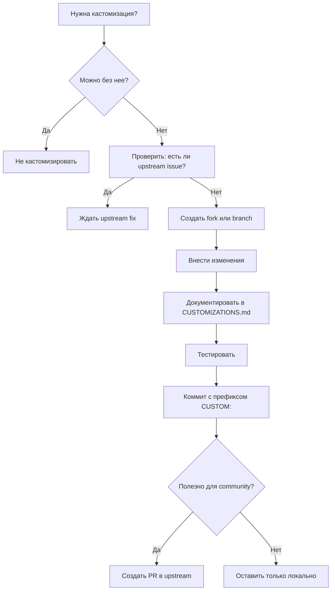

# Customizations — Кастомизации внешних скиллов

**Цель:** Документировать все модификации внешних скиллов для избежания конфликтов при обновлениях

**Owner:** AW (Alexander Wirt)
**Последнее обновление:** 2026-03-07

---

## 📋 Зачем документировать кастомизации?

### Проблема
При обновлении external skills из upstream источников могут возникнуть конфликты:
- Наши изменения перезаписываются upstream версией
- Функциональность ломается
- Теряются WS Agency специфичные адаптации

### Решение
Документировать ВСЕ изменения в этом файле:
- **Что изменено** (файл, строки)
- **Зачем** (причина модификации)
- **Как мержить** (стратегия при обновлении)

---

## 🔍 Формат документации

Для каждой кастомизации:

```markdown
### Skill Name (category/skill-name)

**Source:** github.com/org/repo
**Customized:** YYYY-MM-DD
**Last Upstream Sync:** YYYY-MM-DD
**Customization Type:** [Added | Modified | Removed]

**Changes:**
- File: `path/to/file.md`
  - Lines: 45-67
  - Type: Modified
  - Reason: Adapted for WS Agency workflow (German language support)
  - Merge Strategy: Keep our version (always)

**Testing:**
- Test case: "German input → German output"
- Validation: Run `node test-skill.js`

**Conflict Resolution:**
- If upstream changes this section → manual review required
- Priority: WS customization > upstream
```

---

## 📝 Текущие кастомизации

### Статус на 2026-03-07

**Всего external skills:** 175-185
**Кастомизированных:** 0 (baseline установлен)
**Планируется:** TBD (по мере необходимости)

---

## 🎯 Примеры кастомизаций (будущие)

### Пример 1: ln-100-documents-pipeline (гипотетический)

**Source:** github.com/levnikolaevich/claude-code-skills
**Customized:** 2026-03-15 (пример)
**Last Upstream Sync:** 2026-03-07
**Customization Type:** Modified

**Changes:**
- **File:** `skills/L1-documentation/ln-100-documents-pipeline/SKILL.md`
  - **Lines:** 120-135
  - **Type:** Added section "German Documentation Standards"
  - **Reason:** WS Agency требует документацию на немецком для клиентов
  - **Merge Strategy:** Keep both (ours + upstream), append our section

**Diff:**
```diff
+ ## 🇩🇪 Deutsche Dokumentationsstandards
+
+ Für deutsche Kunden:
+ - README.md → README.de.md (deutsche версия)
+ - CHANGELOG.md → auf Deutsch
+ - Code comments → auf Englisch (standard)
```

**Testing:**
- Запустить skill с параметром `language: de`
- Проверить генерацию README.de.md

**Conflict Resolution:**
- Upstream добавил новую секцию → проверить не пересекается ли с нашей
- Если конфликт → manual merge, сохранить обе версии

---

### Пример 2: seo-audit (гипотетический)

**Source:** github.com/coreyhaines31/marketingskills
**Customized:** 2026-03-20 (пример)
**Last Upstream Sync:** 2026-03-07
**Customization Type:** Added

**Changes:**
- **File:** `skills/L8-marketing/marketing-bundle/content/seo-audit/SKILL.md`
  - **Lines:** 250-280 (new section)
  - **Type:** Added "German SEO Requirements"
  - **Reason:** Deutsche Markt специфика (umlauts, local keywords, Google.de)
  - **Merge Strategy:** Always keep (append to upstream)

**Diff:**
```diff
+ ## 🇩🇪 German SEO Specifics
+
+ **Umlauts Handling:**
+ - ä → ae, ö → oe, ü → ue (URL slugs)
+ - Keep umlauts in meta tags
+
+ **Local Keywords:**
+ - Check Google.de (not .com)
+ - Deutsche keywords priority
+
+ **Hreflang:**
+ - de-DE for Germany
+ - de-AT for Austria
+ - de-CH for Switzerland
```

**Testing:**
- SEO audit для немецкого сайта
- Проверка hreflang tags
- Validation umlauts в URLs

---

## 🛠️ Процесс кастомизации

### Когда кастомизировать?

**✅ Хорошие причины:**
1. Адаптация под WS Agency процессы
2. Локализация (немецкий язык, локальные стандарты)
3. Интеграция с нашими внутренними источниками (Bitrix24, MainWP)
4. Compliance требования (GDPR, немецкое законодательство)
5. Bug fixes не принятые upstream

**❌ Плохие причины:**
1. Косметические изменения (formatting)
2. Личные предпочтения без бизнес-ценности
3. Дублирование функциональности уже есть upstream
4. Временные workarounds (лучше исправить upstream)

### Workflow кастомизации



---

## 📊 Стратегии мержинга

### 1. Keep Ours (Always)
**Когда:** Наша версия критична для бизнеса, upstream несовместим
```bash
# При конфликте:
git checkout --ours path/to/file.md
```

### 2. Keep Theirs + Append Ours
**Когда:** Upstream добавил новое, но наша кастомизация тоже нужна
```bash
# Мануальный merge:
# 1. Принять upstream изменения
# 2. Добавить нашу секцию в конец
```

### 3. Manual Merge (Review Required)
**Когда:** Сложные конфликты, нужен human review
```bash
# Остановить merge:
git merge --abort

# Создать issue для review:
gh issue create --title "Merge conflict: skill-name" --body "..."
```

### 4. Cherry-pick Specific Changes
**Когда:** Нужны только определенные upstream commits
```bash
# Выбрать нужные коммиты:
git cherry-pick abc123def456
```

---

## 🔄 Процесс обновления с кастомизациями

### Еженедельный sync (каждый понедельник)

```bash
#!/bin/bash
# scripts/sync-with-customizations.sh

echo "🔄 Syncing external skills (with customizations)"

# 1. Fetch upstream changes
cd /tmp
git clone https://github.com/levnikolaevich/claude-code-skills.git upstream
cd upstream
git log --since="7 days ago" --oneline > /tmp/upstream-changes.log

# 2. Проверить CUSTOMIZATIONS.md на affected skills
# (парсить markdown, найти измененные файлы)

# 3. Для каждого customized skill:
for skill in $(grep "^### " CUSTOMIZATIONS.md | cut -d' ' -f2); do
  echo "Checking $skill for conflicts..."

  # Compare upstream version with our version
  diff -u upstream/$skill skills/$skill > /tmp/diff-$skill.patch

  if [ -s /tmp/diff-$skill.patch ]; then
    echo "⚠️ Conflict detected in $skill"
    echo "Review required: /tmp/diff-$skill.patch"
  else
    echo "✅ No conflicts in $skill"
  fi
done

echo "✅ Sync check complete"
```

---

## 📋 Чеклист перед кастомизацией

Перед тем как изменить external skill:

- [ ] **Проверил:** Можно ли решить задачу БЕЗ кастомизации?
- [ ] **Поискал:** Есть ли уже upstream issue/PR для этой проблемы?
- [ ] **Оценил:** Effort кастомизации vs создание своего скилла
- [ ] **Задокументировал:** Причину кастомизации
- [ ] **Выбрал стратегию:** Merge strategy на будущее
- [ ] **Создал тесты:** Validation кастомизации
- [ ] **Добавил в CUSTOMIZATIONS.md:** Полное описание
- [ ] **Коммит с префиксом:** `CUSTOM: skill-name - reason`
- [ ] **Рассмотрел PR upstream:** Если полезно для community

---

## 🔗 Ссылки

- [UPSTREAM-SOURCES.md](UPSTREAM-SOURCES.md) - Upstream tracking
- [EXTERNAL-SOURCES-MAP.md](EXTERNAL-SOURCES-MAP.md) - Полная карта источников
- [RECURRING-TASKS.md](C:\Users\alexa\.ws-workspace\workspaces\my-workspace\RECURRING-TASKS.md) - Еженедельный sync
- [CONTRIBUTING.md](CONTRIBUTING.md) - Guidelines для новых скиллов

---

**Последнее обновление:** 2026-03-07 by WS Workspace
**Следующий review:** 2026-03-10 (Monday skills sync)

## 📝 Change Log

### 2026-03-07
- ✅ Создан baseline CUSTOMIZATIONS.md
- ✅ Определены стратегии мержинга
- ✅ Установлен workflow для будущих кастомизаций
- ℹ️ Пока нет кастомизаций (clean baseline)
