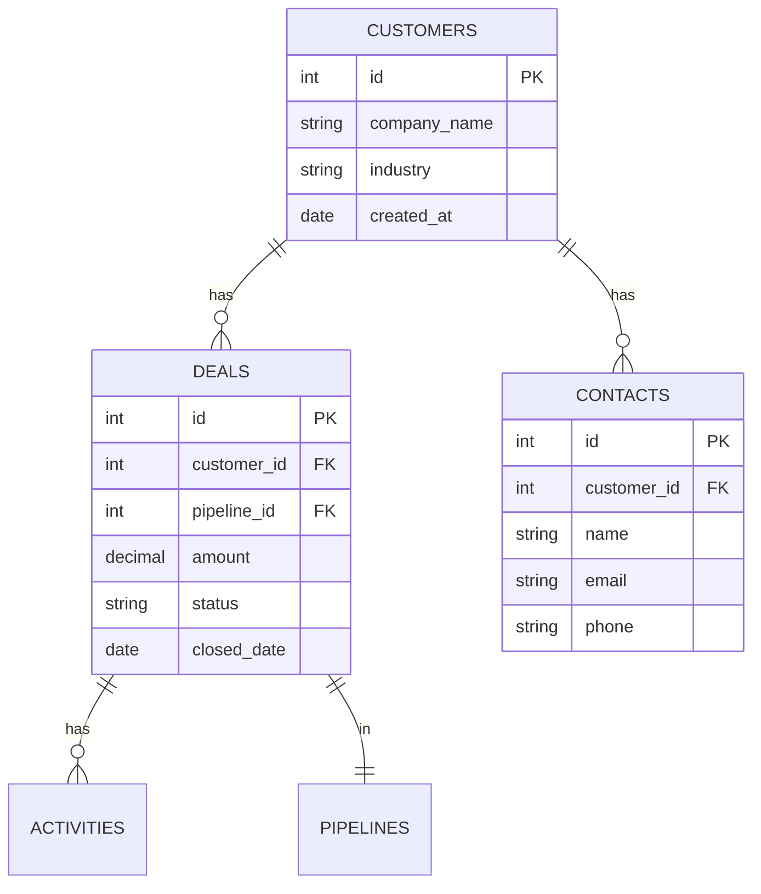

# Data Skill

AI-powered data analysis agent: SQL generation, statistical analysis, dashboard building, data validation. Предназначен для работы с данными в экосистеме Alexander Wirt.

## Команды

### `/data:query`
Генерирует и выполняет SQL запросы:

```bash
/data:query "Show top 10 customers by revenue in Q1 2026"
```

**Workflow:**
1. 🔍 Анализирует database schema
2. ✍️ Генерирует optimized SQL
3. 📊 Выполняет query
4. 📈 Форматирует результаты (datatable/spreadsheet)
5. 💡 Предлагает insights

**Output:**
```sql
-- Top 10 Customers by Revenue (Q1 2026)
SELECT
    c.id,
    c.company_name,
    c.industry,
    SUM(d.amount) as total_revenue,
    COUNT(d.id) as deal_count,
    AVG(d.amount) as avg_deal_size
FROM customers c
INNER JOIN deals d ON c.id = d.customer_id
WHERE d.closed_date BETWEEN '2026-01-01' AND '2026-03-31'
    AND d.status = 'won'
GROUP BY c.id, c.company_name, c.industry
ORDER BY total_revenue DESC
LIMIT 10;
```

```datatable
{
  "title": "Top 10 Customers by Revenue (Q1 2026)",
  "columns": [
    { "key": "company_name", "label": "Company", "type": "text" },
    { "key": "industry", "label": "Industry", "type": "text" },
    { "key": "total_revenue", "label": "Revenue", "type": "currency" },
    { "key": "deal_count", "label": "Deals", "type": "number" },
    { "key": "avg_deal_size", "label": "Avg Deal", "type": "currency" }
  ],
  "rows": [
    { "company_name": "MEGA Mietpark", "industry": "Real Estate", "total_revenue": 125000, "deal_count": 8, "avg_deal_size": 15625 }
  ]
}
```

**Insights:**
```markdown
## Key Insights
- 🏆 Top customer: MEGA Mietpark (€125K, 8 deals)
- 📊 Real Estate industry leads (40% of top 10 revenue)
- 💰 Average deal size: €18,200 (↑12% vs Q4 2025)
- 🎯 Recommendation: Focus sales efforts on Real Estate segment
```

### `/data:analyze`
Статистический анализ данных:

```bash
/data:analyze "conversion rates by traffic source"
```

**Анализирует:**
- Descriptive statistics (mean, median, std dev)
- Correlations
- Trends и seasonality
- Outliers
- Statistical significance

**Output:**
```markdown
## Conversion Rate Analysis by Traffic Source

### Summary Statistics

| Source | Sessions | Conversions | Conv Rate | Avg Order |
|--------|----------|-------------|-----------|-----------|
| Organic Search | 12,450 | 438 | 3.52% | €185 |
| Google Ads | 8,230 | 412 | 5.01% | €210 |
| Social Media | 5,120 | 98 | 1.91% | €95 |
| Direct | 3,890 | 156 | 4.01% | €220 |

### Statistical Insights

**Conversion Rate Distribution:**
- Mean: 3.61%
- Median: 3.77%
- Std Dev: 1.24%
- Best performer: Google Ads (5.01%, +38% vs mean)
- Worst performer: Social Media (1.91%, -47% vs mean)

**Correlation Analysis:**
- ✅ Strong correlation (0.78): Avg Order Value ↔ Conversion Rate
- ✅ Medium correlation (0.52): Session Duration ↔ Conversion
- ❌ Weak correlation (0.12): Traffic Volume ↔ Conversion Rate

**Statistical Significance:**
- Google Ads vs Organic: **p < 0.01** (highly significant)
- Social Media vs Others: **p < 0.05** (significant underperformance)

### Recommendations
1. 🎯 **Increase Google Ads budget** (highest ROI: 5.01% conv rate, €210 AOV)
2. 🔍 **Investigate Social Media** (1.91% is significantly below average)
3. 💰 **Optimize for AOV** (strong correlation with conversion rate)
```

### `/data:dashboard`
Создаёт интерактивный dashboard:

```bash
/data:dashboard "Sales performance Q1 2026"
```

**Генерирует HTML dashboard с:**
- KPI cards (revenue, deals, conversion rate)
- Charts (trends, breakdown, comparison)
- Data tables (top performers, bottom performers)
- Filters (date range, segment, source)

**Output:**
```html
<!DOCTYPE html>
<html>
<head>
  <title>Sales Performance Dashboard - Q1 2026</title>
  <script src="https://cdn.jsdelivr.net/npm/chart.js"></script>
  <style>/* Dashboard styling */</style>
</head>
<body>
  <div class="dashboard">
    <!-- KPI Cards -->
    <div class="kpi-grid">
      <div class="kpi-card">
        <h3>Total Revenue</h3>
        <p class="value">€425,600</p>
        <p class="change positive">+18% vs Q4 2025</p>
      </div>
      <div class="kpi-card">
        <h3>Deals Closed</h3>
        <p class="value">156</p>
        <p class="change positive">+12% vs Q4</p>
      </div>
      <div class="kpi-card">
        <h3>Avg Deal Size</h3>
        <p class="value">€2,728</p>
        <p class="change negative">-3% vs Q4</p>
      </div>
    </div>

    <!-- Revenue Trend Chart -->
    <canvas id="revenueTrend"></canvas>

    <!-- Top Customers Table -->
    <table id="topCustomers">...</table>
  </div>
  <script>/* Chart.js config */</script>
</body>
</html>
```

Используй `html-preview` block для отображения:
```html-preview
{
  "src": "/path/to/dashboard.html",
  "title": "Sales Performance Dashboard - Q1 2026"
}
```

### `/data:validate`
Валидация данных и проверка качества:

```bash
/data:validate "customers table"
```

**Проверяет:**
- Missing values (NULL, empty strings)
- Duplicates
- Data type consistency
- Referential integrity
- Business rule violations
- Outliers

**Output:**
```markdown
## Data Validation Report: customers

### Summary
- ✅ Total records: 1,245
- ⚠️ Issues found: 23 (1.8%)
- 🔴 Critical: 3
- 🟠 Medium: 12
- 🟡 Low: 8

### Critical Issues

**1. Duplicate emails (3 records)**
```sql
SELECT email, COUNT(*)
FROM customers
GROUP BY email
HAVING COUNT(*) > 1;
```

| Email | Count |
|-------|-------|
| max@example.de | 2 |
| john@test.com | 2 |

**Action**: Merge duplicate records or add unique constraint

**2. Invalid email format (5 records)**
```sql
SELECT id, email
FROM customers
WHERE email NOT LIKE '%_@_%._%';
```

**Action**: Correct email addresses or mark for cleanup

### Medium Issues

**1. Missing phone numbers (12 records)**
- IDs: 45, 78, 123, 156, ...
- Impact: Cannot contact for support
- **Action**: Request phone numbers via email campaign

**2. Outdated industry codes (8 records)**
- Using old classification (pre-2025)
- **Action**: Run migration to new industry taxonomy

### Low Issues

**1. NULL in optional fields (8 records)**
- company_size: NULL (8 records) — acceptable
- website: NULL (3 records) — could improve profiling

### Recommendations
1. 🔴 **Immediate**: Fix duplicate emails (data integrity)
2. 🟠 **This week**: Validate and correct email formats
3. 🟡 **This month**: Enrich missing phone numbers
```

### `/data:export`
Экспорт данных в различные форматы:

```bash
/data:export "Q1 sales report" --format xlsx
```

**Форматы:**
- **XLSX** (Excel) — spreadsheet с formatting
- **CSV** — raw data
- **JSON** — для API integration
- **PDF** — formatted report

**Output (XLSX):**
```spreadsheet
{
  "filename": "Q1_Sales_Report_2026.xlsx",
  "sheetName": "Summary",
  "columns": [
    { "key": "month", "label": "Month", "type": "text" },
    { "key": "revenue", "label": "Revenue", "type": "currency" },
    { "key": "deals", "label": "Deals", "type": "number" },
    { "key": "growth", "label": "Growth", "type": "percent" }
  ],
  "rows": [
    { "month": "January", "revenue": 142000, "deals": 52, "growth": 0.15 },
    { "month": "February", "revenue": 138500, "deals": 48, "growth": -0.02 },
    { "month": "March", "revenue": 145100, "deals": 56, "growth": 0.05 }
  ]
}
```

### `/data:schema`
Анализирует database schema:

```bash
/data:schema "crm_database"
```

**Output:**


```markdown
## Schema Analysis

### Tables
- **customers** (1,245 rows)
  - Primary Key: id
  - Foreign Keys: None
  - Indexes: email (unique), industry, created_at

- **deals** (3,892 rows)
  - Primary Key: id
  - Foreign Keys: customer_id → customers.id, pipeline_id → pipelines.id
  - Indexes: customer_id, status, closed_date

### Relationships
- customers 1:N deals (1,245 customers → 3,892 deals, avg 3.1 deals/customer)
- customers 1:N contacts (1,245 customers → 2,890 contacts, avg 2.3 contacts/customer)

### Data Distribution
- **deals.status**: won (42%), lost (28%), open (30%)
- **customers.industry**: Real Estate (24%), E-commerce (18%), SaaS (15%), Other (43%)

### Recommendations
- ✅ Add index on `deals.amount` (frequent queries by revenue)
- ✅ Archive closed deals > 2 years old (performance)
- ⚠️ Consider partitioning deals table by year
```

## Интеграции

### Database Connectors
- **PostgreSQL** (CRM AI Cockpit primary DB)
- **Snowflake** (data warehouse, если настроен)
- **BigQuery** (Google Analytics data)
- **Databricks** (advanced analytics)

### Visualization Tools
- **Chart.js** (dashboards)
- **Datatable/Spreadsheet blocks** (WS Workspace native)
- **Excel export** (ln-820-xlsx-reporter skill)

### Business Tools
- **Google Sheets** (sync via ln-851-sheets-sync)
- **Notion** (embed dashboards)
- **Bitrix24** (CRM analytics)

## Принципы

- **Query optimization**: Всегда генерируй efficient SQL (indexes, JOINs)
- **Data validation**: Проверяй input data quality before analysis
- **Insight generation**: Raw data → actionable insights
- **Visualization-first**: Tables для details, charts для trends
- **Security**: Никогда не экспортируй sensitive data без approval

## Best Practices

### 1. **Understand schema first**
Запускай `/data:schema` перед написанием запросов.

### 2. **Optimize queries**
- Используй indexes
- LIMIT результаты для exploration
- Avoid SELECT * (выбирай только нужные колонки)

### 3. **Validate before analysis**
Запускай `/data:validate` на новых datasets.

### 4. **Visualize insights**
Datatable/spreadsheet для details, charts для trends.

### 5. **Document queries**
Сохраняй frequently used queries в Notion/GitHub.

## Примеры

### CRM AI Cockpit Analytics
```bash
/data:query "Show pipeline conversion rate by stage"
/data:analyze "deal velocity by industry"
/data:dashboard "CRM KPIs - current month"
```

### E-commerce (Topholz24)
```bash
/data:query "Top 20 products by revenue last 30 days"
/data:analyze "customer lifetime value by acquisition channel"
/data:export "Product performance Q1" --format xlsx
```

### Marketing (WS Agency)
```bash
/data:query "Campaign ROI by channel"
/data:analyze "correlation between ad spend and conversions"
/data:dashboard "Marketing performance dashboard"
```

## Метрики

Data Skill отслеживает:
- **Query execution time** (target: < 2s для dashboards)
- **Query optimization** (use of indexes, explain plans)
- **Insight quality** (actionable vs descriptive)
- **Data accuracy** (validation pass rate)

Используй `/data:stats` для performance metrics.
