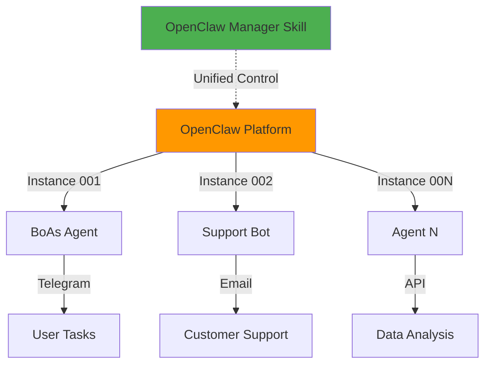
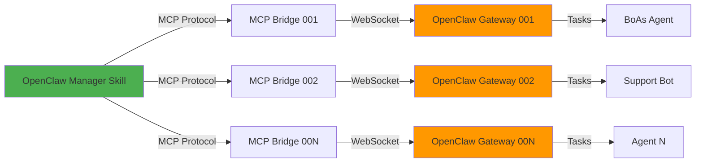

# OpenClaw Manager

Универсальный skill для управления **ВСЕМИ** OpenClaw агентами через единый интерфейс.

## 🎯 Философия

**OpenClaw** - это платформа для запуска AI-агентов (как Kubernetes для контейнеров).
Каждый **instance** - это отдельный агент с уникальными задачами и конфигурацией.



---

## 🚀 Основные возможности

### 1. Управление задачами (Tasks)

#### Создание задачи для конкретного агента
```
Создай задачу для агента #001: "Проанализируй репозиторий crm-ai-cockpit"
Приоритет: high

Новая задача для #002: "Ответь на email поддержки"

Поставь задачу агенту #001: "Собери данные конкурентов"
```

**Параметры:**
- `instance` (обязательно) - номер инстанса (#001, #002, etc.)
- `title` (обязательно) - краткое название задачи
- `description` (опционально) - детальное описание
- `priority` (опционально) - low, medium, high

#### Просмотр задач

**Все задачи всех агентов:**
```
Покажи все задачи
Список всех задач OpenClaw
```

**Задачи конкретного агента:**
```
Задачи агента #001
Что делает агент #002?
```

**Фильтрация по статусу:**
```
Покажи активные задачи
Завершённые задачи за сегодня
Все failed задачи
```

---

### 2. Мониторинг статуса агентов

#### Статус всех агентов
```
Статус всех агентов
Health check OpenClaw
Какие агенты online?
```

**Ожидаемый результат:**
```datatable
{
  "title": "OpenClaw Agents Status",
  "columns": [
    { "key": "instance", "label": "Instance", "type": "text" },
    { "key": "name", "label": "Name", "type": "text" },
    { "key": "status", "label": "Status", "type": "badge" },
    { "key": "uptime", "label": "Uptime", "type": "text" },
    { "key": "tasks", "label": "Active Tasks", "type": "number" }
  ],
  "rows": [
    { "instance": "#001", "name": "BoAs Agent", "status": "online", "uptime": "3d 5h", "tasks": 3 },
    { "instance": "#002", "name": "Support Bot", "status": "online", "uptime": "1d 2h", "tasks": 1 }
  ]
}
```

#### Статус конкретного агента
```
Статус агента #001
Проверь агент #002
```

---

### 3. Управление сеансами (Sessions)

#### Просмотр сеансов
```
Покажи все сеансы
Активные сеансы агента #001
```

#### Отправка сообщения в сеанс
```
Отправь в сеанс #001-session-123: "Добавь анализ безопасности"

Напиши в сеанс #002-support-456: "Приоритизируй этот тикет"
```

#### История сеанса
```
История сеанса #001-session-123
Что происходило в сеансе #002-support-456?
```

---

### 4. Управление каналами (Channels)

#### Статус каналов
```
Статус каналов агента #001
Проверь все каналы OpenClaw
```

#### Управление каналами
```
Запусти Telegram канал агента #001
Останови Email канал агента #002
```

---

### 5. Системная информация

#### Логи
```
Покажи логи агента #001
Последние ошибки всех агентов
Логи за последний час
```

**Параметры:**
- `level` - error, warn, info, debug
- `limit` - количество записей
- `since` - с какого времени

#### Конфигурация
```
Конфигурация агента #001
Настройки всех агентов
```

---

## 📋 Доступные MCP Tools

### Управление агентом
- `agent_status` - статус агента и health check

### Управление задачами
- `task_create` - создание новой задачи
- `task_list` - список задач с фильтрацией

### Управление сеансами
- `session_list` - список активных сеансов
- `session_send` - отправка сообщения в сеанс
- `session_history` - полная история сеанса

### Управление каналами
- `channel_status` - статус каналов связи (Telegram, Email, etc.)
- `channel_start` - запуск/остановка канала

### Система
- `config_get` - получение конфигурации
- `logs_read` - чтение логов с фильтрацией

---

## 🔧 Технические детали

### Архитектура



### Подключение

**Instance 001 (BoAs Agent):**
- URL: `wss://001.srv2.it-reality.de/mcp-jsonrpc`
- Source: `openclaw` (BoAs Agent)
- AUTH_TOKEN: настроен в source config

**Instance 002+:**
- Добавляются как отдельные MCP sources
- Каждый со своим endpoint и токеном
- Автоматическая агрегация через skill

### Масштабируемость

Skill **автоматически работает** с любым количеством инстансов:
- ✅ Детектит все доступные sources с префиксом `openclaw-*`
- ✅ Агрегирует данные со всех инстансов
- ✅ Поддерживает таргетинг на конкретный instance
- ✅ Graceful fallback при недоступности инстансов

---

## 💡 Примеры использования

### Пример 1: Создание задач для разных агентов

```
/openclaw-manager

Создай задачу для агента #001: "Проанализируй конкурентов Topholz24 и создай отчёт по ценам"
Приоритет: high

Создай задачу для агента #002: "Обработай все email в поддержке за последние 24 часа"
Приоритет: medium
```

**Результат:**
```
✅ Задача #001-789 создана для BoAs Agent
📋 Описание: Проанализировать конкурентов Topholz24
⚡ Приоритет: High
📅 Создана: 2026-02-16 19:20:00

✅ Задача #002-456 создана для Support Bot
📋 Описание: Обработать email в поддержке
⚡ Приоритет: Medium
📅 Создана: 2026-02-16 19:20:05
```

---

### Пример 2: Мониторинг всех агентов

```
/openclaw-manager

Статус всех агентов
```

**Результат:**
```datatable
{
  "title": "OpenClaw Platform Status - 2026-02-16 19:25:00",
  "columns": [
    { "key": "instance", "label": "Instance", "type": "text" },
    { "key": "name", "label": "Agent Name", "type": "text" },
    { "key": "status", "label": "Status", "type": "badge" },
    { "key": "health", "label": "Health", "type": "number" },
    { "key": "uptime", "label": "Uptime", "type": "text" },
    { "key": "activeTasks", "label": "Active Tasks", "type": "number" },
    { "key": "completedToday", "label": "Completed Today", "type": "number" }
  ],
  "rows": [
    {
      "instance": "#001",
      "name": "BoAs Agent",
      "status": "online",
      "health": 95,
      "uptime": "3d 5h 23m",
      "activeTasks": 3,
      "completedToday": 12
    },
    {
      "instance": "#002",
      "name": "Support Bot",
      "status": "online",
      "health": 98,
      "uptime": "1d 2h 45m",
      "activeTasks": 1,
      "completedToday": 8
    }
  ]
}
```

---

### Пример 3: Просмотр всех задач

```
/openclaw-manager

Покажи все активные задачи
```

**Результат:**
```datatable
{
  "title": "All Active Tasks Across OpenClaw Platform",
  "columns": [
    { "key": "taskId", "label": "Task ID", "type": "text" },
    { "key": "instance", "label": "Instance", "type": "text" },
    { "key": "title", "label": "Title", "type": "text" },
    { "key": "status", "label": "Status", "type": "badge" },
    { "key": "priority", "label": "Priority", "type": "badge" },
    { "key": "progress", "label": "Progress", "type": "percent" },
    { "key": "created", "label": "Created", "type": "date" }
  ],
  "rows": [
    {
      "taskId": "#001-789",
      "instance": "#001",
      "title": "Анализ конкурентов Topholz24",
      "status": "running",
      "priority": "high",
      "progress": 0.45,
      "created": "2026-02-16T18:20:00Z"
    },
    {
      "taskId": "#001-790",
      "instance": "#001",
      "title": "Сбор данных из Google Analytics",
      "status": "pending",
      "priority": "medium",
      "progress": 0,
      "created": "2026-02-16T18:35:00Z"
    },
    {
      "taskId": "#002-456",
      "instance": "#002",
      "title": "Обработка email поддержки",
      "status": "running",
      "priority": "medium",
      "progress": 0.65,
      "created": "2026-02-16T18:20:05Z"
    }
  ]
}
```

---

### Пример 4: Управление сеансом

```
/openclaw-manager

История сеанса #001-session-789
```

**Результат:**
```
📋 Сеанс #001-session-789 (Agent #001 - BoAs Agent)

Задача: "Анализ конкурентов Topholz24"
Статус: Running (45% завершено)
Длительность: 15m 30s

--- История выполнения ---

[19:20:00] 🤖 Начинаю выполнение задачи...
[19:20:15] 🔍 Подключаюсь к Bitrix24 для получения списка конкурентов
[19:21:30] 📊 Найдено 8 конкурентов
[19:22:00] 🌐 Запускаю парсинг сайтов конкурентов
[19:25:00] 📝 Конкурент 1: holz24.de - собрано 150 позиций
[19:28:00] 📝 Конкурент 2: holzhandel-deutschland.de - собрано 89 позиций
[19:31:00] 📝 Конкурент 3: bauholz-shop.de - собрано 210 позиций
[19:34:00] 📊 Анализирую ценовые диапазоны...

⏳ В процессе выполнения...
```

**Отправка уточнения:**
```
/openclaw-manager

Отправь в сеанс #001-session-789: "Добавь анализ доставки и сроков поставки для каждого конкурента"
```

**Результат:**
```
✅ Сообщение отправлено в сеанс #001-session-789

[19:35:00] 👤 User: "Добавь анализ доставки и сроков поставки для каждого конкурента"
[19:35:05] 🤖 Понял! Добавляю анализ логистики в отчёт...
```

---

## 🎨 Интеграции с другими системами

### С GitHub (через github source)
```
Создай задачу для #001: "Проверь все открытые PR в repos 2Penguins, создай саммари и отправь в Slack"
```

### С Bitrix24 (через bitrix24 source)
```
Создай задачу для #001: "Собери все лиды за неделю из Bitrix24, проанализируй конверсию и создай Excel отчёт"
```

### С Google Workspace (через google-workspace source)
```
Создай задачу для #002: "Найди все email с темой 'Support' за февраль и создай сводку проблем в Google Docs"
```

### Multi-agent orchestration
```
Создай задачу для #001: "Собери данные конкурентов"

Создай задачу для #002: "Когда #001 закончит, возьми его данные и создай презентацию PowerPoint"
```

---

## 🔒 Security

### Аутентификация
- Каждый инстанс имеет свой `AUTH_TOKEN`
- HMAC-SHA256 challenge-response для WebSocket
- Токены хранятся в `.env` source конфигурации
- Периодическая ротация рекомендуется раз в 3 месяца

### Изоляция
- Каждый инстанс работает в изолированной Docker сети
- Контейнеры не могут общаться между собой напрямую
- Все коммуникации через OpenClaw Gateway

### Мониторинг
- Все действия логируются с timestamp и user context
- Логи доступны через `logs_read` tool
- Health checks каждые 30 секунд

---

## 📊 Best Practices

### 1. Чёткие инструкции
Формулируйте задачи максимально конкретно:
- ✅ "Собери цены на OSB-плиты 12мм у 5 конкурентов и создай сравнительную таблицу в Excel"
- ❌ "Собери данные конкурентов"

### 2. Правильный выбор агента
- **#001 (BoAs)** - сложные аналитические задачи, интеграции, автоматизация
- **#002 (Support)** - обработка email, customer support, FAQ
- **#00N** - специализированные задачи

### 3. Приоритизация
- `high` - критичные задачи (SLA < 1 час)
- `medium` - стандартные задачи (SLA < 4 часа)
- `low` - фоновые задачи (SLA < 24 часа)

### 4. Мониторинг
Регулярно проверяйте:
```
Статус всех агентов  # Каждое утро
Все активные задачи   # 2 раза в день
Ошибки за последний час  # При проблемах
```

### 5. Использование сеансов
- Используйте `session_send` для уточнения задач в процессе выполнения
- Проверяйте `session_history` при ошибках для диагностики
- Сохраняйте `sessionKey` важных задач для отслеживания

---

## 🐛 Troubleshooting

### Проблема: "Agent offline"

**Симптомы:**
```json
{
  "status": "offline",
  "error": "OpenClaw WebSocket disconnected"
}
```

**Решение:**
```bash
# На сервере (SSH)
docker ps | grep openclaw-gateway-001
docker logs openclaw-gateway-001 --tail 50

# Если не запущен
cd /home/openclaw_u/openclaw/instance_001
docker compose up -d openclaw-gateway
```

---

### Проблема: "Task execution timeout"

**Симптомы:**
Задача висит в статусе "running" более 30 минут без прогресса.

**Решение:**
1. Проверьте историю сеанса:
   ```
   История сеанса #001-session-XXX
   ```

2. Отправьте уточнение:
   ```
   Отправь в сеанс #001-session-XXX: "Прерви текущую операцию и создай промежуточный отчёт"
   ```

3. Если не помогает - создайте новую упрощённую задачу

---

### Проблема: "Connection failed"

**Симптомы:**
```
Error: MCP Bridge connection failed
```

**Решение:**
1. Проверьте доступность сервера:
   ```bash
   curl https://001.srv2.it-reality.de/mcp-jsonrpc
   ```

2. Проверьте AUTH_TOKEN в source config:
   ```bash
   # Должен быть валидный HMAC-SHA256 токен
   cat ~/.ws-workspace/workspaces/my-workspace/sources/openclaw/config.json
   ```

3. Проверьте логи MCP bridge:
   ```bash
   # Смотрите stderr вывод при подключении
   ```

---

### Проблема: "Invalid JSON response"

**Симптомы:**
```
error: "invalid json response body... Unexpected token '<'"
```

**Причина:**
OpenClaw Gateway API возвращает HTML (страницу ошибки) вместо JSON.

**Решение:**
```bash
# Проверьте доступность API
curl http://openclaw-gateway-001:18789/api/tasks

# Проверьте health endpoint
curl http://openclaw-gateway-001:18789/health

# Перезапустите gateway
cd /home/openclaw_u/openclaw/instance_001
docker compose restart openclaw-gateway
```

---

## 🚀 Быстрый старт

### 1. Проверка статуса
```
/openclaw-manager

Статус всех агентов
```

### 2. Создание первой задачи
```
/openclaw-manager

Создай задачу для агента #001: "Протестируй подключение к Bitrix24 API и выведи список последних 5 лидов"
Приоритет: high
```

### 3. Мониторинг выполнения
```
/openclaw-manager

Задачи агента #001
```

### 4. Просмотр результата
```
/openclaw-manager

История сеанса #001-session-XXX
```

---

## 📈 Roadmap

### Phase 1: Core Functionality (Completed ✅)
- [x] Управление задачами (create, list)
- [x] Мониторинг статуса агентов
- [x] Управление сеансами (send, history)
- [x] Управление каналами (start, stop)
- [x] Системные операции (logs, config)

### Phase 2: Enhanced Monitoring (Planned)
- [ ] Dashboard с метриками в реальном времени
- [ ] Alerting при критических ошибках
- [ ] Performance analytics по агентам
- [ ] SLA tracking и отчёты

### Phase 3: Advanced Automation (Future)
- [ ] Task templates для типовых задач
- [ ] Scheduled tasks (cron-like)
- [ ] Multi-agent orchestration (task dependencies)
- [ ] Auto-scaling инстансов
- [ ] Cost tracking по usage

### Phase 4: AI Enhancement (Vision)
- [ ] AI-powered task routing (оптимальный выбор агента)
- [ ] Predictive failure detection
- [ ] Auto-optimization конфигураций
- [ ] Natural language task creation с AI parsing

---

## 📚 Связанные Skills

- **`memory-write`** - Сохранение результатов задач в Agency Memory
- **`github-workflow`** - Интеграция с GitHub для CI/CD задач
- **`semrush-report`** - SEO анализ для маркетинговых задач
- **`usage-monitor`** - Мониторинг Claude API usage

---

## 📝 Changelog

### v1.0.0 (2026-02-16)
- ✅ Начальный релиз
- ✅ Поддержка всех 10 MCP tools
- ✅ Универсальное управление множественными инстансами
- ✅ Агрегированный мониторинг статуса
- ✅ Полная документация с примерами

---

**Автор:** WS Workspace
**Версия:** 1.0.0
**Последнее обновление:** 2026-02-16
**Лицензия:** MIT
**Поддержка:** https://github.com/ws-agency/openclaw-manager
