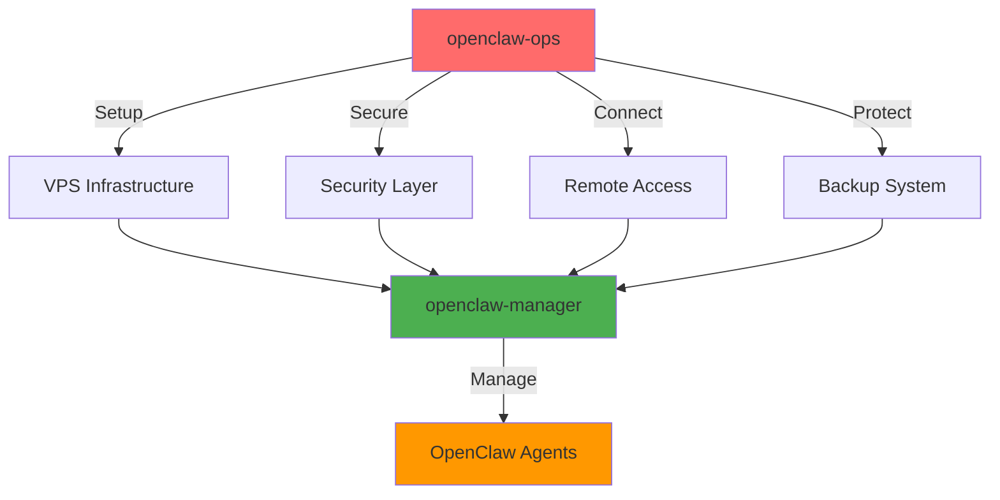

# OpenClaw Ops

Comprehensive инфраструктурный skill для управления OpenClaw VPS: установка, безопасность, удаленный доступ, резервное копирование и мониторинг.

## 🎯 Философия

**OpenClaw Ops** vs **OpenClaw Manager**:
- **openclaw-ops** → Infrastructure/DevOps (VPS, security, networking)
- **openclaw-manager** → Application (agents, tasks, sessions)



---

## 📚 Категории операций

### 1. 🚀 Setup & Onboarding
### 2. ⚙️ Gateway Configuration
### 3. 🔒 Security Hardening
### 4. 🌐 Remote Access
### 5. 💾 Backup & Restore
### 6. 📊 Monitoring & Troubleshooting
### 7. 🔧 Maintenance & Updates
### 8. 🐳 Docker Operations (Hetzner VPS)
### 9. 📦 Instance Inventory (Real Infrastructure Data)
### 10. 🔌 MCP Connection Status (2026-02-21)

---

## 1. 🚀 Setup & Onboarding

### Первичная настройка VPS

#### 1.1 Подготовка swap file (для VPS с 1-2GB RAM)

```bash
# Выделить 2GB файл подкачки
sudo fallocate -l 2G /swapfile

# Защитить права доступа (только root)
sudo chmod 600 /swapfile

# Отформатировать как swap
sudo mkswap /swapfile

# Активировать немедленно
sudo swapon /swapfile

# Автозапуск после перезагрузки
echo '/swapfile none swap sw 0 0' | sudo tee -a /etc/fstab

# Проверка
free -h
```

**Когда использовать:**
- VPS с 1-2GB RAM
- Перед установкой OpenClaw
- Для предотвращения OOM kills

---

#### 1.2 Синхронизация времени NTP

```bash
# Проверить статус NTP
timedatectl status

# Если не активен - установить chrony
sudo apt install chrony

# Включить автозапуск
sudo systemctl enable chrony

# Проверить синхронизацию
chronyc tracking
```

**Зачем:** Точные временные метки для логов и security auditing.

---

#### 1.3 Установка OpenClaw

```bash
# Скачать и запустить официальный установщик
curl -fsSL https://openclaw.ai/install.sh | bash

# Проверить версию Node.js (должна быть 22.12.0+)
node --version

# Интерактивный onboarding + установка daemon
openclaw onboard --install-daemon

# Сгенерировать gateway auth token для продакшна
export GATEWAY_AUTH_TOKEN="$(openssl rand -hex 32)"
echo "export GATEWAY_AUTH_TOKEN='$GATEWAY_AUTH_TOKEN'" >> ~/.profile
```

---

#### 1.4 Неинтерактивная установка (CI/CD)

```bash
# С кастомным LLM провайдером (Ollama, LiteLLM)
export CUSTOM_API_KEY="your-api-key-here"

openclaw onboard --non-interactive --install-daemon \
  --custom-base-url "http://localhost:11434/v1" \
  --custom-model-id "llama3" \
  --custom-provider-id "ollama" \
  --custom-compatibility openai

# С Anthropic через API key
openclaw onboard --non-interactive --install-daemon \
  --auth-choice anthropic \
  --custom-api-key "sk-ant-..."
```

**Флаги:**
- `--custom-base-url` - URL эндпоинта провайдера
- `--custom-model-id` - ID модели
- `--custom-api-key` - API ключ (лучше через CUSTOM_API_KEY env var)
- `--custom-provider-id` - ID провайдера (auto-detect из URL)
- `--custom-compatibility` - openai или anthropic

**⚠️ Security:** Избегайте передачи API ключей через CLI флаги - используйте env var.

---

### Примеры использования

```
/openclaw-ops

Помоги настроить новый VPS для OpenClaw:
- 2GB RAM Hetzner VPS
- Нужен swap file
- Установка с Anthropic API
- Tailscale для удаленного доступа
```

**Результат:**
```bash
# Пошаговый скрипт установки
#!/bin/bash
set -e

echo "🚀 OpenClaw VPS Setup - начинаем..."

# 1. Swap file
echo "📦 Настройка swap file..."
sudo fallocate -l 2G /swapfile
sudo chmod 600 /swapfile
sudo mkswap /swapfile
sudo swapon /swapfile
echo '/swapfile none swap sw 0 0' | sudo tee -a /etc/fstab

# 2. NTP
echo "⏰ Установка chrony..."
sudo apt update
sudo apt install -y chrony
sudo systemctl enable chrony

# 3. OpenClaw
echo "🦞 Установка OpenClaw..."
curl -fsSL https://openclaw.ai/install.sh | bash

# 4. Gateway token
echo "🔐 Генерация gateway auth token..."
export GATEWAY_AUTH_TOKEN="$(openssl rand -hex 32)"
echo "export GATEWAY_AUTH_TOKEN='$GATEWAY_AUTH_TOKEN'" >> ~/.profile

echo "✅ Базовая установка завершена!"
echo "📋 Следующие шаги:"
echo "   1. Запустите: openclaw onboard --install-daemon"
echo "   2. Настройте Tailscale (см. раздел 4)"
echo "   3. Усильте безопасность (см. раздел 3)"
```

---

## 2. ⚙️ Gateway Configuration

### 2.1 Loopback mode (самый безопасный)

```bash
# Шлюз слушает только на 127.0.0.1:18789
# Доступ только через SSH tunnel или Tailscale
```

**В openclaw.json:**
```json
{
  "gateway": {
    "bind": "loopback",
    "port": 18789
  }
}
```

**Проверка:**
```bash
openclaw gateway status
openclaw status
openclaw health
```

---

### 2.2 Security audit

```bash
# Глубокий security scan
openclaw security audit --deep

# Автоматическое исправление найденных проблем
openclaw security audit --fix
```

---

## 3. 🔒 Security Hardening

### 3.1 Базовые рекомендации

**Best practices:**
- ✅ Минимизируйте количество плагинов
- ✅ Используйте отдельные учетные записи мессенджеров для бота
- ✅ Относитесь к эндпоинтам управления браузером как к admin API
- ✅ Ротируйте токены каждые 3 месяца
- ✅ Ограничьте права доступа: `chmod 700 ~/.openclaw`

---

### 3.2 Отключение mDNS/Bonjour обнаружения

**Проблема на VPS:**
- Виртуальный хостинг: другие арендаторы видят OpenClaw
- Нет пользы: вы подключаетесь через SSH/Tailscale, не через local discovery

**Решение:**

```bash
# Через environment variable
export OPENCLAW_DISABLE_BONJOUR=1
echo 'export OPENCLAW_DISABLE_BONJOUR=1' >> ~/.profile
```

**Или в openclaw.json:**
```json
{
  "discovery": {
    "mdns": { "mode": "off" }
  }
}
```

---

### 3.3 Защита истории команд

```bash
# Не сохранять команды, начинающиеся с пробела, и дубликаты
export HISTCONTROL=ignoreboth

# Отключить запись в .bash_history (критично для секретов)
export HISTFILESIZE=0

# Добавить в ~/.profile или ~/.bashrc
cat >> ~/.profile <<'EOF'
export HISTCONTROL=ignoreboth
export HISTFILESIZE=0
EOF
```

---

### 3.4 Автоматические обновления безопасности

```bash
# Установить unattended-upgrades
sudo apt install unattended-upgrades

# Включить автоматические обновления
sudo dpkg-reconfigure unattended-upgrades
```

---

### 3.5 Fail2ban для защиты SSH

```bash
# Установить fail2ban
sudo apt install fail2ban

# Включить автозапуск
sudo systemctl enable fail2ban
sudo systemctl start fail2ban

# Проверить статус
sudo fail2ban-client status sshd
```

**Что делает:** Блокирует IP после множественных неудачных попыток входа по SSH.

---

### 3.6 UFW Firewall

#### Базовая настройка:

```bash
# Заблокировать все входящие по умолчанию
sudo ufw default deny incoming
sudo ufw default allow outgoing

# Разрешить SSH (если не используете только Tailscale)
sudo ufw allow 22/tcp

# Активировать firewall
sudo ufw enable

# Проверить статус
sudo ufw status verbose
```

#### Только Tailscale (без публичного SSH):

```bash
# ⚠️ ВАЖНО: Убедитесь, что Tailscale работает ПЕРЕД включением!

# Блокировать все
sudo ufw default deny incoming
sudo ufw default allow outgoing

# Разрешить только через Tailscale интерфейс
sudo ufw allow in on tailscale0

# Активировать
sudo ufw enable

# Проверить
sudo ufw status verbose
```

**Восстановление при блокировке:** Используйте веб-консоль провайдера (Hetzner Console, DigitalOcean Access, AWS EC2 Instance Connect).

---

### 3.7 Systemd resource limits

**Для user service (~/.config/systemd/user/openclaw-gateway.service):**

```ini
[Unit]
Description=OpenClaw Gateway
After=network-online.target
Wants=network-online.target

[Service]
Type=simple
ExecStart=%h/.openclaw/bin/openclaw gateway --foreground
Restart=on-failure
RestartSec=5
Environment=NODE_ENV=production

# Resource limits
MemoryMax=1G
CPUQuota=80%

# Security hardening
NoNewPrivileges=true
ProtectSystem=strict
ProtectHome=read-only
ReadWritePaths=%h/.openclaw

[Install]
WantedBy=default.target
```

**Активация:**

```bash
# Перезагрузить конфигурацию
systemctl --user daemon-reload

# Включить автозапуск
systemctl --user enable openclaw-gateway

# Запустить
systemctl --user start openclaw-gateway

# Включить "linger" (работает даже при logout)
loginctl enable-linger $(whoami)
```

---

### 3.8 Headless Chromium (для browser agent)

```bash
# Установить Chromium из Ubuntu репозитория
sudo apt install chromium-browser

# Проверить версию
chromium-browser --version
```

**В openclaw.json:**
```json
{
  "browser": {
    "evaluateEnabled": false
  }
}
```

**❌ Чего НЕ делать:**
- ❌ НЕ запускайте отдельный Chrome DevTools Protocol сервис
- ❌ НЕ используйте `--remote-debugging-port=18800`
- ❌ НЕ устанавливайте сторонние browser management пакеты

OpenClaw управляет браузером самостоятельно.

---

### Примеры использования

```
/openclaw-ops

Усиль безопасность моего VPS:
- Отключи mDNS
- Настрой Fail2ban
- Firewall только для Tailscale
- Resource limits для gateway
```

---

## 4. 🌐 Remote Access

### 4.1 Tailscale Setup (рекомендуется)

#### На VPS:

```bash
# Установить Tailscale
curl -fsSL https://tailscale.com/install.sh | sh

# Подключиться (откроет URL для авторизации в браузере)
sudo tailscale up

# Для headless VPS - используйте auth key
sudo tailscale up --auth-key=tskey-auth-XXXXX

# Проверить статус
tailscale status

# Узнать Tailscale IP
tailscale ip -4
```

#### Tailscale SSH (опционально):

```bash
# Включить SSH через Tailscale (убирает порт 22 из публичного интернета)
sudo tailscale up --ssh

# Проверить: с локальной машины
ssh user@100.x.y.z  # Должен работать без SSH ключа
```

---

#### На клиентских устройствах:

| Платформа | Установка |
|-----------|-----------|
| macOS | `brew install tailscale` или https://tailscale.com/download |
| Windows | https://tailscale.com/download |
| Linux | `curl -fsSL https://tailscale.com/install.sh \| sh` |
| iOS/Android | App Store / Play Store |

**После установки:** Войдите с тем же провайдером идентификации (Google, Microsoft, Apple).

---

#### Shields-up на персональных устройствах:

```bash
# На НОУТБУКЕ/ТЕЛЕФОНЕ (не на VPS!):
# Блокирует входящие подключения от других tailnet устройств
tailscale set --shields-up

# Разрешить входящие снова
tailscale set --shields-up=false
```

**Зачем:** Уменьшает attack surface - другие tailnet устройства не могут подключиться к вашему ноутбуку.

---

### 4.2 Tailscale Serve (HTTPS для tailnet)

```bash
# Публикация gateway через HTTPS в приватной tailnet
sudo tailscale serve --bg --https=443 127.0.0.1:18789

# Проверить
tailscale serve status

# Остановить
tailscale serve reset
```

**Доступ:** `https://<machine-name>.<tailnet>.ts.net/`

**В openclaw.json:**
```json
{
  "gateway": {
    "bind": "loopback",
    "tailscale": { "mode": "serve" },
    "auth": { "allowTailscale": true }
  }
}
```

**Или через CLI:**
```bash
openclaw gateway --tailscale serve
```

---

### 4.3 Tailscale Funnel (публичный интернет) ⚠️

```bash
# ⚠️ ВНИМАНИЕ: Открывает gateway для ПУБЛИЧНОГО интернета
sudo tailscale funnel --https=443 127.0.0.1:18789
```

**Порты Funnel:** Только 443, 8443, 10000.

**⚠️ Security:**
- При использовании Funnel вы ДОЛЖНЫ установить `gateway.auth.mode: "password"`
- Tailscale identity headers НЕ доступны для публичных запросов
- ❌ Избегайте Funnel для browser management endpoints

---

### 4.4 Tailscale ACL (усиление)

**Ограничение:** Каждый пользователь может подключаться только к своим устройствам.

**В Tailscale Admin Console → ACL Editor:**

```json
{
  "acls": [
    {
      "action": "accept",
      "src": ["autogroup:member"],
      "dst": ["autogroup:self:*"]
    }
  ]
}
```

**Что делает:** Предотвращает доступ других участников tailnet к вашему VPS.

---

### 4.5 SSH Tunnel (запасной вариант)

**Если не можете использовать Tailscale:**

```bash
# На локальной машине:
# Проброс порта 18789 с VPS на localhost:18789
ssh -N -L 18789:127.0.0.1:18789 user@gateway-host
```

**Доступ:** `http://127.0.0.1:18789/`

**Недостатки:**
- Нет автоматического TLS
- Нет identity-based auth
- SSH сессия должна оставаться открытой

---

### Справочник по конфигурации

| Ключ | Значение | Назначение |
|------|----------|------------|
| `gateway.bind` | "loopback" | Шлюз слушает только 127.0.0.1 |
| `gateway.tailscale.mode` | "serve" / "funnel" / "off" | Уровень доступности |
| `gateway.auth.allowTailscale` | true | Принимать Tailscale identity headers |
| `gateway.tailscale.resetOnExit` | true | Очистка Serve config при выходе |

---

### Примеры использования

```
/openclaw-ops

Настрой Tailscale на моем OpenClaw VPS:
- Установи Tailscale
- Включи Tailscale SSH
- Настрой Serve для HTTPS доступа
- Firewall только для tailscale0
```

**Результат:**
```bash
#!/bin/bash
set -e

echo "🌐 Tailscale Setup для OpenClaw..."

# 1. Установка Tailscale
echo "📦 Установка Tailscale..."
curl -fsSL https://tailscale.com/install.sh | sh

# 2. Подключение с SSH
echo "🔐 Включение Tailscale SSH..."
sudo tailscale up --ssh

# 3. Проверка
TAILSCALE_IP=$(tailscale ip -4)
echo "✅ Tailscale IP: $TAILSCALE_IP"

# 4. Tailscale Serve
echo "🚀 Настройка Tailscale Serve..."
sudo tailscale serve --bg --https=443 127.0.0.1:18789

# 5. UFW для Tailscale only
echo "🔥 Настройка firewall..."
sudo ufw default deny incoming
sudo ufw default allow outgoing
sudo ufw allow in on tailscale0
sudo ufw --force enable

# 6. OpenClaw config
cat >> ~/.openclaw/openclaw.json <<'EOF'
{
  "gateway": {
    "bind": "loopback",
    "tailscale": { "mode": "serve" },
    "auth": { "allowTailscale": true }
  }
}
EOF

# 7. Restart gateway
systemctl --user restart openclaw-gateway

echo "✅ Tailscale setup завершен!"
echo "📋 Доступ: https://$(hostname).<your-tailnet>.ts.net/"
echo "🔒 SSH: ssh user@$TAILSCALE_IP"
```

---

## 5. 💾 Backup & Restore

### 5.1 Создание резервной копии

**Полная резервная копия (~/.openclaw/):**

```bash
# Полный backup (включая session logs)
tar czf openclaw-backup-$(date +%Y%m%d).tar.gz -C ~/ .openclaw/

# Privacy-conscious backup (без logs и temp)
tar czf openclaw-backup-$(date +%Y%m%d).tar.gz \
  --exclude='.openclaw/sessions' \
  --exclude='.openclaw/workspace' \
  -C ~/ .openclaw/
```

---

### 5.2 Восстановление из резервной копии

```bash
# 1. Остановить gateway
systemctl --user stop openclaw-gateway

# 2. Восстановить из архива
tar xzf openclaw-backup-YYYYMMDD.tar.gz -C ~/

# 3. Установить правильные права
chmod 700 ~/.openclaw
chmod 600 ~/.openclaw/openclaw.json

# 4. Перезапустить gateway
systemctl --user start openclaw-gateway
```

---

### 5.3 Автоматическое резервное копирование (cron)

```bash
# Создать директорию для backup
mkdir -p ~/backups

# Добавить weekly cron job (каждое воскресенье в 2:00)
echo "0 2 * * 0 $(whoami) tar czf /home/$(whoami)/backups/openclaw-backup-\$(date +\%Y\%m\%d).tar.gz -C /home/$(whoami)/ .openclaw/" | sudo tee -a /etc/crontab > /dev/null
```

---

### 5.4 Что включает резервная копия

**~/.openclaw/ содержит:**
- `openclaw.json` - конфигурация gateway
- `auth/` - OAuth токены, credentials
- `profiles/` - LLM provider profiles
- `sessions/` - история сеансов (опционально)
- `workspace/` - временные файлы (опционально)

**⚠️ Security:**
- Резервные копии содержат API ключи и токены в открытом виде
- Храните в зашифрованном месте (LUKS volume, encrypted S3 bucket)
- Никогда не коммитьте в Git

---

### 5.5 Зашифрованное хранилище (LUKS)

**Advanced: Encrypted partition для ~/.openclaw/**

```bash
# Установить cryptsetup
sudo apt install cryptsetup

# Создать зашифрованный раздел (УНИЧТОЖИТ ВСЕ ДАННЫЕ на /dev/sdX!)
sudo cryptsetup luksFormat /dev/sdX

# Разблокировать
sudo cryptsetup open /dev/sdX openclaw-vault

# Создать файловую систему
sudo mkfs.ext4 /dev/mapper/openclaw-vault

# Примонтировать
sudo mount /dev/mapper/openclaw-vault /home/openclaw/.openclaw

# Установить владельца
sudo chown openclaw:openclaw /home/openclaw/.openclaw
```

**В systemd service:**
```ini
[Unit]
RequiresMountsFor=/home/openclaw/.openclaw
```

**⚠️ Важно:** Требует ручной разблокировки при перезагрузке (или файл ключа - что снижает безопасность).

---

### Примеры использования

```
/openclaw-ops

Настрой автоматическое резервное копирование:
- Еженедельный backup в ~/backups/
- Исключить session logs (privacy)
- Ротация: хранить последние 4 backup
```

**Результат:**
```bash
#!/bin/bash
set -e

echo "💾 Настройка автоматического backup..."

# 1. Создать директорию
mkdir -p ~/backups

# 2. Создать backup script
cat > ~/backups/openclaw-backup.sh <<'EOF'
#!/bin/bash
BACKUP_DIR=~/backups
DATE=$(date +%Y%m%d)
BACKUP_FILE="$BACKUP_DIR/openclaw-backup-$DATE.tar.gz"

# Создать backup (без sessions и workspace)
tar czf "$BACKUP_FILE" \
  --exclude='.openclaw/sessions' \
  --exclude='.openclaw/workspace' \
  -C ~/ .openclaw/

# Ротация: оставить только последние 4
cd "$BACKUP_DIR"
ls -t openclaw-backup-*.tar.gz | tail -n +5 | xargs -r rm

echo "✅ Backup создан: $BACKUP_FILE"
EOF

chmod +x ~/backups/openclaw-backup.sh

# 3. Добавить в crontab (каждое воскресенье в 2:00)
(crontab -l 2>/dev/null; echo "0 2 * * 0 ~/backups/openclaw-backup.sh") | crontab -

echo "✅ Автоматический backup настроен!"
echo "📋 Расписание: Каждое воскресенье в 02:00"
echo "📂 Директория: ~/backups/"
echo "🔄 Ротация: Последние 4 backup"
echo ""
echo "Запустить вручную: ~/backups/openclaw-backup.sh"
```

---

## 6. 📊 Monitoring & Troubleshooting

### 6.1 Проверка статуса

```bash
# Статус gateway process
openclaw gateway status

# Общий статус всех компонентов
openclaw status

# Health check (проверка отклика)
openclaw health

# Deep security audit
openclaw security audit --deep
```

---

### 6.2 Логи

```bash
# Статус всех компонентов
openclaw status --all

# Live logs (Ctrl+C для остановки)
openclaw logs --follow

# Systemd logs для user service
journalctl --user -u openclaw-gateway -f

# Последние 50 строк
journalctl --user -u openclaw-gateway -n 50
```

---

### 6.3 Типичные проблемы

#### Проблема: Gateway не запускается

**Симптомы:**
```bash
$ openclaw gateway status
Error: Gateway process not running
```

**Решение:**

```bash
# 1. Проверить systemd service
systemctl --user status openclaw-gateway

# 2. Просмотреть логи
journalctl --user -u openclaw-gateway --no-pager -n 50

# 3. Проверить конфигурацию
cat ~/.openclaw/openclaw.json | jq

# 4. Перезапустить
systemctl --user restart openclaw-gateway
```

---

#### Проблема: Несоответствие profile/конфигурации

**Симптомы:**
- Health check fails
- "Invalid LLM provider"
- Authentication errors

**Решение:**

```bash
# Проверить active profile
openclaw profile current

# Проверить доступные profiles
openclaw profile list

# Пересоздать profile
openclaw onboard
```

---

#### Проблема: Gateway crash-loop (502 Bad Gateway, но контейнер "Running")

**Симптомы:**
- Dashboard возвращает **502 Bad Gateway**
- `docker ps` показывает контейнер в статусе **Running** (restart counter растёт)
- MCP `agent_status` показывает `openclaw_connected: false`
- Контейнер перезапускается каждые ~60 секунд

**Диагностика:**

```bash
# 1. Проверить логи контейнера напрямую (Docker logs могут быть пусты при crash-loop)
cat /var/lib/docker/containers/<container_id>/<container_id>-json.log | tail -100

# 2. Или через docker logs
docker logs openclaw-gateway-001 --tail 100
```

**Ключевая ошибка в логах:**
```
Config invalid
File: ~/.openclaw/openclaw.json
Problem:
  - channels.discord.guilds.<guild_id>: Unrecognized keys: "name", "enabled"
Run: openclaw doctor --fix
```

**Причина:** OpenClaw использует **строгую валидацию** конфигурации. Если в `openclaw.json` появились нераспознанные ключи (например, через Dashboard Chat или CLI), gateway не может запуститься и входит в crash-loop.

**Решение:**

```bash
# Вариант 1: Если есть SSH доступ к серверу
# Отредактировать openclaw.json напрямую
docker exec -it openclaw-gateway-001 bash
# Внутри контейнера:
vi /home/node/.openclaw/openclaw.json
# Удалить нераспознанные ключи

# Вариант 2: Через Hetzner Rescue Mode (если SSH недоступен)
# См. раздел 8.11 "Hetzner Rescue Mode"

# Вариант 3: Через docker cp
docker cp openclaw-gateway-001:/home/node/.openclaw/openclaw.json ./openclaw-backup.json
# Отредактировать файл, удалить невалидные ключи
docker cp ./openclaw-fixed.json openclaw-gateway-001:/home/node/.openclaw/openclaw.json
docker exec -u 0 openclaw-gateway-001 chown 1000:1000 /home/node/.openclaw/openclaw.json
docker compose restart openclaw-gateway
```

**Конкретный случай — Discord guilds:**

Discord guild объекты принимают **ТОЛЬКО** ключ `channels`. Ключи `name` и `enabled` **невалидны** и вызывают crash-loop:

```json
// ❌ НЕВЕРНО — вызывает crash-loop
"guilds": {
  "1234567890": {
    "name": "My Server",        // ← невалидный ключ
    "enabled": true,             // ← невалидный ключ
    "channels": {
      "9876543210": {
        "name": "general",       // ← невалидный ключ
        "enabled": true          // ← невалидный ключ
      }
    }
  }
}

// ✅ ВЕРНО — минимальный валидный формат
"guilds": {
  "1234567890": {
    "channels": {
      "9876543210": {}
    }
  }
}
```

**Python-скрипт для автоматического исправления:**

```python
import json

with open('openclaw.json') as f:
    cfg = json.load(f)

guilds = cfg.get('channels', {}).get('discord', {}).get('guilds', {})
for gid in guilds:
    guilds[gid].pop('name', None)
    guilds[gid].pop('enabled', None)
    if 'channels' in guilds[gid]:
        for cid in guilds[gid]['channels']:
            guilds[gid]['channels'][cid].pop('name', None)
            guilds[gid]['channels'][cid].pop('enabled', None)

with open('openclaw.json', 'w') as f:
    json.dump(cfg, f, indent=2)
```

**⚠️ Важно:** Эта проблема может возникнуть при любом обновлении конфигурации через Dashboard Chat, если агент добавит нераспознанные ключи. Всегда проверяйте логи контейнера при 502 ошибках.

---

#### Проблема: Port already in use

**Симптомы:**
```
Error: Port 18789 already in use
```

**Решение:**

```bash
# Найти процесс на порту 18789
sudo lsof -i :18789

# Или через netstat
sudo netstat -tulpn | grep 18789

# Убить процесс (если это zombie process)
kill -9 <PID>

# Перезапустить gateway
systemctl --user restart openclaw-gateway
```

---

### 6.4 Performance monitoring

```bash
# CPU и Memory usage процесса
ps aux | grep openclaw

# Подробная статистика
systemctl --user status openclaw-gateway

# Логи с метриками
openclaw logs --follow | grep -E "(memory|cpu|latency)"
```

---

### Примеры использования

```
/openclaw-ops

Gateway не отвечает на health check. Помоги диагностировать:
- Проверь статус процесса
- Покажи последние 50 строк логов
- Проверь порт 18789
```

---

## 7. 🔧 Maintenance & Updates

### 7.1 Обновление OpenClaw

```bash
# Проверить текущую версию
openclaw --version

# Обновить до последней версии
curl -fsSL https://openclaw.ai/install.sh | bash

# Перезапустить gateway
systemctl --user restart openclaw-gateway

# Проверить новую версию
openclaw --version
```

---

### 7.2 Ротация токенов

**Gateway Auth Token:**

```bash
# Сгенерировать новый токен
NEW_TOKEN="$(openssl rand -hex 32)"

# Обновить в ~/.profile
sed -i "s/GATEWAY_AUTH_TOKEN=.*/GATEWAY_AUTH_TOKEN='$NEW_TOKEN'/" ~/.profile

# Обновить в openclaw.json (если используется)
# ... manual edit ...

# Перезапустить gateway
systemctl --user restart openclaw-gateway

# Обновить в MCP source configs на клиентах
echo "⚠️ Не забудьте обновить AUTH_TOKEN в source config!"
```

**Рекомендуется:** Ротация каждые 3 месяца.

---

### 7.3 Обновление системных пакетов

```bash
# Обновить package list
sudo apt update

# Обновить все пакеты
sudo apt upgrade -y

# Обновить Node.js (если нужна новая версия)
node --version  # Должна быть 22.12.0+

# Если устарела - обновить через nvm или apt
```

---

### 7.4 Очистка старых session logs

```bash
# Размер директории sessions
du -sh ~/.openclaw/sessions

# Удалить сессии старше 30 дней
find ~/.openclaw/sessions -type d -mtime +30 -exec rm -rf {} +

# Или удалить все сессии (если не нужна история)
rm -rf ~/.openclaw/sessions/*
```

---

### 7.5 Docker cleanup (для Docker-based setup)

```bash
# Остановить containers
docker compose down

# Удалить неиспользуемые images
docker image prune -a

# Удалить неиспользуемые volumes
docker volume prune

# Перезапустить
docker compose up -d
```

---

## 8. 🐳 Docker Operations (Hetzner VPS)

**⚠️ Этот раздел применим ТОЛЬКО для Docker-based установки OpenClaw на Hetzner VPS**

### 8.1 Архитектура Docker-based установки

#### Структура инстансов

**Каждый инстанс состоит из 3 контейнеров:**
- `openclaw-gateway-XXX` - основной контейнер, вся логика и процессы (всегда запущен)
- `openclaw-cli-XXX` - CLI конфигуратор (запускается по запросу, сразу удаляется)
- `mcp-bridge-XXX` - MCP мост для JSON-RPC подключений сторонних инструментов

**Изоляция:**
- Каждый инстанс в своей Docker сети `openclaw_XXX`
- Контейнеры разных инстансов НЕ могут общаться друг с другом

---

#### Структура файлов

```
/home/openclaw_u/openclaw/
├── shared/                          # Общие данные для всех инстансов
│   ├── Dockerfile                   # Сборка openclaw-gateway и openclaw-cli
│   ├── .dockerignore
│   ├── mcp/                         # Данные для сборки mcp-bridge
│   └── openclaw/                    # Репозиторий OpenClaw (git)
│
└── instance_XXX/                    # Данные конкретного инстанса (001, 002, etc.)
    ├── data/                        # Монтируется в /home/node/.openclaw (persistence)
    ├── docker-compose.yml           # Управление контейнерами
    ├── .env                         # Секреты (AUTH_TOKEN, API_KEY, etc.)
    └── openclaw-cli.json            # Доп. конфиг для CLI (remote connection)
```

---

#### Nginx Reverse Proxy (внешний доступ)

**Каждый инстанс имеет nginx reverse proxy** для HTTPS доступа извне:

```
Клиент → nginx (443/HTTPS) → Docker контейнеры
```

**Конфигурация nginx** (`/etc/nginx/sites-available/XXX.srv2.it-reality.de`):

```nginx
# Основной маршрут → Gateway (Dashboard SPA + WebSocket)
location / {
    proxy_pass http://localhost:19001;    # gateway mapped port
    proxy_http_version 1.1;
    proxy_set_header Upgrade $http_upgrade;
    proxy_set_header Connection "upgrade";
}

# MCP JSON-RPC → MCP Bridge (отдельный контейнер)
location /mcp-jsonrpc {
    proxy_pass http://localhost:15001/mcp-jsonrpc;   # mcp-bridge mapped port
    proxy_http_version 1.1;
    proxy_set_header Upgrade $http_upgrade;
    proxy_set_header Connection "upgrade";
    proxy_read_timeout 3600s;    # длительные WebSocket сеансы
}
```

**Маппинг портов:**

| Контейнер | Внутренний порт | Маппинг на хост | Nginx upstream |
|-----------|----------------|-----------------|----------------|
| `openclaw-gateway-XXX` | 18789 | 19001 | `localhost:19001` |
| `mcp-bridge-XXX` | 3001 | 15001 | `localhost:15001` |

**⚠️ Важно:**
- Gateway (порт 19001) обслуживает **SPA Dashboard** с catch-all routing
- ВСЕ несуществующие маршруты (включая `/api/*`) возвращают HTML страницу Dashboard
- MCP Bridge (порт 15001) обрабатывает **только** `/mcp-jsonrpc` WebSocket подключения
- `proxy_read_timeout 3600s` критичен для MCP — без него WebSocket закроется через 60с

---

#### Права доступа и persistence

**Важно:**
- OpenClaw в контейнере работает от `node:node` (UID/GID **1000**)
- Данные монтируются из `instance_XXX/data` → `/home/node/.openclaw` в контейнере
- Локальные файлы должны принадлежать UID/GID 1000, иначе OpenClaw не сможет писать
- User `openclaw_u` имеет доступ только на чтение (UID отличается от 1000)

**Для изменения файлов:**
- Либо работать через `docker exec` внутри контейнера (от user node)
- Либо использовать `docker cp` + `chown 1000:1000` через root

---

### 8.2 Навигация и базовые команды

#### Переход в директорию инстанса

```bash
# Перейти в директорию инстанса 001
cd /home/openclaw_u/openclaw/instance_001

# Или инстанс 002
cd /home/openclaw_u/openclaw/instance_002
```

**⚠️ Важно:** Все команды `docker compose` выполняются ИЗ директории инстанса.

---

#### Список контейнеров

```bash
# Все контейнеры на сервере
docker ps

# Только контейнеры конкретного инстанса
docker ps | grep 001

# Показать все (включая остановленные)
docker ps -a
```

---

### 8.3 Управление контейнерами

#### Остановка

```bash
# Остановить ВСЕ контейнеры инстанса
docker compose down

# Остановка с удалением volumes (данные openclaw НЕ трогаются!)
docker compose down -v
```

**Что удаляется при `down -v`:**
- ✅ Контейнеры
- ✅ Сеть
- ✅ Временные volumes
- ❌ **НЕ** удаляются данные в `instance_XXX/data`

---

#### Запуск/перезапуск

```bash
# Запустить ВСЕ контейнеры инстанса
docker compose up -d

# Запустить только gateway и mcp-bridge
docker compose up -d openclaw-gateway mcp-bridge

# Перезапустить gateway
docker compose restart openclaw-gateway
```

**Флаг `-d`:** detached mode (в фоне)

---

#### Сборка образа

**Когда нужна пересборка:**
- Изменился Dockerfile
- Обновилась версия OpenClaw
- Добавлены новые зависимости

```bash
# Пересобрать образ и пересоздать контейнеры
docker compose up -d --build

# Только для gateway
docker compose up -d --build openclaw-gateway

# Только для mcp-bridge
docker compose up -d --build mcp-bridge
```

---

### 8.4 Работа с файлами

#### Выполнение команд в контейнере

```bash
# Одноразовая команда
docker exec openclaw-gateway-001 ls /home/node/.openclaw/credentials

# Интерактивный shell (для множественных команд)
docker exec -it openclaw-gateway-001 bash

# Выход из shell
exit
```

---

#### Копирование файлов ИЗ контейнера

```bash
# Копировать файл из контейнера на сервер
docker cp openclaw-gateway-001:/home/node/.openclaw/credentials/google ./

# Копировать директорию
docker cp openclaw-gateway-001:/home/node/.openclaw/profiles ./profiles-backup/
```

**Владелец:** Скопированные файлы будут принадлежать `openclaw_u`

---

#### Копирование файлов В контейнер

```bash
# 1. Скопировать файл
docker cp ./blabla.txt openclaw-gateway-001:/home/node/.openclaw/credentials/

# 2. Изменить владельца на node:node (1000:1000)
docker exec -u 0 openclaw-gateway-001 chown 1000:1000 /home/node/.openclaw/credentials/blabla.txt
```

**⚠️ Важно:** `-u 0` выполняет команду от root, чтобы сделать `chown`

---

### 8.5 Обновление OpenClaw

```bash
# 1. Перейти в репозиторий
cd /home/openclaw_u/openclaw/shared/openclaw

# 2. Обновить код (git pull)
git pull

# 3. Проверить текущую версию (опционально)
git log -1 --oneline

# 4. Перейти в инстанс
cd /home/openclaw_u/openclaw/instance_001

# 5. Пересобрать и перезапустить gateway
docker compose up -d --build openclaw-gateway
```

**⚠️ Предупреждение:**
- Новые версии могут ломать обратную совместимость
- **Обязательно сделайте backup** перед обновлением
- Тестируйте на одном инстансе, прежде чем обновлять все

---

### 8.6 Просмотр логов

#### Через Docker

```bash
# Последние логи gateway
docker logs openclaw-gateway-001

# Live logs (Ctrl+C для выхода)
docker logs openclaw-gateway-001 -f

# Последние 100 строк
docker logs openclaw-gateway-001 --tail 100

# Логи с временными метками
docker logs openclaw-gateway-001 -t
```

---

#### Через веб-интерфейс

**OpenClaw Gateway UI** имеет встроенный раздел **Logs** с:
- Структурированным выводом
- Фильтрацией по уровню (error, warn, info, debug)
- Поиском по тексту

**Доступ:** `https://<gateway-url>/logs`

---

### 8.7 OpenClaw CLI

#### Базовые команды

```bash
# Переход в директорию инстанса
cd /home/openclaw_u/openclaw/instance_001

# Справка по всем командам
docker compose run --rm openclaw-cli help

# Актуальная документация
# https://docs.openclaw.ai/cli
```

---

#### Управление моделями

```bash
# Настроить LLM провайдера
docker compose run --rm openclaw-cli configure --section model
```

---

#### Управление каналами (мессенджеры)

```bash
# Добавить новый канал (Telegram, WhatsApp, Email, etc.)
docker compose run --rm openclaw-cli channels add
```

---

#### Telegram Pairing (Approve User)

**Workflow:**
1. Пользователь запускает бота в Telegram
2. Бот выдает 6-digit код
3. Admin approve через CLI:

```bash
docker compose run --rm openclaw-cli pairing approve telegram <code>
```

**Пример:**
```bash
# Пользователь получил код: 123456
docker compose run --rm openclaw-cli pairing approve telegram 123456
```

**Результат:** Пользователь авторизован и может общаться с ботом.

---

#### Remote connection для CLI

**Проблема:** Некоторые команды (например `devices`) требуют подключения к gateway, но CLI запускается в отдельном контейнере.

**Симптом:**
```
[openclaw] CLI failed: Error: gateway closed (1006 abnormal closure)
```

**Решение:**

1. Раскомментировать строку в `docker-compose.yml`:
   ```yaml
   # Было:
   # - ./openclaw-cli.json:/home/node/.openclaw/openclaw.json:ro

   # Стало:
   - ./openclaw-cli.json:/home/node/.openclaw/openclaw.json:ro
   ```

2. Выполнить команду:
   ```bash
   docker compose run --rm openclaw-cli devices
   ```

3. **Закомментировать обратно** после использования:
   ```yaml
   # - ./openclaw-cli.json:/home/node/.openclaw/openclaw.json:ro
   ```

**⚠️ Важно:** Если оставить раскомментированным, команды, которые редактируют конфиг, не смогут сохранить изменения.

---

### 8.8 Browser Fix

**Когда нужно:** Headless browser в контейнере зависает или работает некорректно.

```bash
# 1. Очистить browser user data
docker exec openclaw-gateway-001 rm -rf /home/node/.openclaw/browser/openclaw/user-data

# 2. Перейти в директорию инстанса
cd /home/openclaw_u/openclaw/instance_001

# 3. Перезапустить контейнеры
docker compose down
docker compose up -d openclaw-gateway mcp-bridge
```

---

### 8.9 Backup инстанса

```bash
# 1. Остановить контейнеры (опционально, для консистентности)
cd /home/openclaw_u/openclaw/instance_001
docker compose down

# 2. Создать архив данных
tar czf ~/backups/openclaw-instance-001-$(date +%Y%m%d).tar.gz \
  -C /home/openclaw_u/openclaw/ instance_001/data

# 3. Запустить контейнеры обратно
docker compose up -d

# 4. Проверить размер backup
ls -lh ~/backups/
```

**Что включено в backup:**
- Конфигурация OpenClaw
- OAuth credentials
- Профили LLM
- История сессий (если не исключена)
- Workspace данные

---

### 8.10 Восстановление инстанса

```bash
# 1. Остановить контейнеры
cd /home/openclaw_u/openclaw/instance_001
docker compose down

# 2. Удалить текущие данные (опционально)
sudo rm -rf /home/openclaw_u/openclaw/instance_001/data/*

# 3. Восстановить из backup
tar xzf ~/backups/openclaw-instance-001-YYYYMMDD.tar.gz \
  -C /home/openclaw_u/openclaw/

# 4. Исправить права (важно!)
sudo chown -R 1000:1000 /home/openclaw_u/openclaw/instance_001/data

# 5. Запустить контейнеры
docker compose up -d
```

---

### Примеры использования

#### Пример 1: Добавить нового пользователя Telegram

```
/openclaw-ops

Помоги добавить нового пользователя в Telegram бота (инстанс 001):
1. Пользователь получил код: 789456
2. Сделай approve
```

**Результат:**
```bash
cd /home/openclaw_u/openclaw/instance_001
docker compose run --rm openclaw-cli pairing approve telegram 789456
```

---

#### Пример 2: Обновить OpenClaw на инстансе 001

```
/openclaw-ops

Обнови OpenClaw на инстансе 001:
- Сделай backup перед обновлением
- Pull latest version
- Rebuild gateway
```

**Результат:**
```bash
#!/bin/bash
set -e

echo "🔄 Обновление OpenClaw instance 001..."

# 1. Backup
echo "📦 Создание backup..."
cd /home/openclaw_u/openclaw/instance_001
docker compose down
tar czf ~/backups/openclaw-001-pre-update-$(date +%Y%m%d-%H%M%S).tar.gz \
  -C /home/openclaw_u/openclaw/ instance_001/data

# 2. Pull latest code
echo "⬇️ Обновление репозитория..."
cd /home/openclaw_u/openclaw/shared/openclaw
git pull
git log -1 --oneline

# 3. Rebuild gateway
echo "🔨 Пересборка gateway..."
cd /home/openclaw_u/openclaw/instance_001
docker compose up -d --build openclaw-gateway

# 4. Check logs
echo "📋 Проверка логов..."
sleep 5
docker logs openclaw-gateway-001 --tail 50

echo "✅ Обновление завершено!"
```

---

#### Пример 3: Troubleshooting - Gateway не отвечает

```
/openclaw-ops

Gateway инстанса 001 не отвечает:
- Проверь статус контейнера
- Покажи последние 100 строк логов
- Если нужно - перезапусти
```

**Результат:**
```bash
#!/bin/bash
cd /home/openclaw_u/openclaw/instance_001

echo "🔍 Проверка статуса контейнеров..."
docker ps | grep openclaw-001

echo ""
echo "📋 Последние 100 строк логов..."
docker logs openclaw-gateway-001 --tail 100

# Если в логах видны ошибки - перезапуск
echo ""
read -p "Перезапустить gateway? (y/n) " -n 1 -r
echo
if [[ $REPLY =~ ^[Yy]$ ]]
then
    echo "🔄 Перезапуск gateway..."
    docker compose restart openclaw-gateway
    sleep 5
    docker logs openclaw-gateway-001 --tail 20
fi
```

---

### Docker Troubleshooting

#### Проблема: "Container not found"

**Симптомы:**
```
Error: No such container: openclaw-gateway-001
```

**Решение:**

```bash
# Проверить список контейнеров
docker ps -a

# Запустить заново
cd /home/openclaw_u/openclaw/instance_001
docker compose up -d
```

---

#### Проблема: "Permission denied" при записи

**Симптомы:**
```
Error: EACCES: permission denied, open '/home/node/.openclaw/config.json'
```

**Причина:** Файлы в `instance_XXX/data` не принадлежат UID 1000

**Решение:**

```bash
# Исправить права для всей директории data
sudo chown -R 1000:1000 /home/openclaw_u/openclaw/instance_001/data

# Проверить
ls -la /home/openclaw_u/openclaw/instance_001/data
```

---

#### Проблема: "Network already exists"

**Симптомы:**
```
Error: network openclaw_001 already exists
```

**Решение:**

```bash
# Удалить старую сеть
docker network rm openclaw_001

# Или полный cleanup
cd /home/openclaw_u/openclaw/instance_001
docker compose down -v
docker compose up -d
```

---

#### Проблема: Browser зависает в контейнере

**Симптомы:**
- Таймауты при browser automation
- "Page navigation timeout"
- Контейнер использует 100% CPU

**Решение:**

```bash
# Применить Browser Fix (раздел 8.8)
docker exec openclaw-gateway-001 rm -rf /home/node/.openclaw/browser/openclaw/user-data
cd /home/openclaw_u/openclaw/instance_001
docker compose restart openclaw-gateway
```

---

### 8.11 Hetzner Rescue Mode (экстренный доступ)

**Когда использовать:** SSH порт 22 закрыт/недоступен, Tailscale не настроен, веб-консоль Hetzner не работает — единственный способ попасть на сервер.

**Предпосылки:**
- Доступ к Hetzner Cloud Console (https://console.hetzner.com)
- Или Hetzner Cloud API token с правами Read & Write

---

#### Workflow через Hetzner Cloud API

**Шаг 1: Создать API токен** (если нет)
- Hetzner Console → Security → API Tokens → Generate API Token
- Права: Read & Write
- Сохранить токен (показывается только один раз)

**Шаг 2: Сгенерировать временный SSH ключ**

```bash
# Создать временный ключ (без пароля для автоматизации)
ssh-keygen -t ed25519 -f ~/.ssh/hetzner_rescue_temp -N ""
```

**Шаг 3: Загрузить SSH ключ в Hetzner**

```bash
HETZNER_TOKEN="your-api-token"
PUBLIC_KEY=$(cat ~/.ssh/hetzner_rescue_temp.pub)

# Загрузить ключ
curl -s -X POST "https://api.hetzner.cloud/v1/ssh_keys" \
  -H "Authorization: Bearer $HETZNER_TOKEN" \
  -H "Content-Type: application/json" \
  -d "{\"name\": \"rescue-temp\", \"public_key\": \"$PUBLIC_KEY\"}"

# Запомнить ID ключа из ответа (например: 107927347)
```

**Шаг 4: Включить Rescue Mode**

```bash
SERVER_ID=118864740  # ID сервера из Hetzner Console URL
SSH_KEY_ID=107927347  # ID из шага 3

# Включить rescue mode
curl -s -X POST "https://api.hetzner.cloud/v1/servers/$SERVER_ID/actions/enable_rescue" \
  -H "Authorization: Bearer $HETZNER_TOKEN" \
  -H "Content-Type: application/json" \
  -d "{\"type\": \"linux64\", \"ssh_keys\": [$SSH_KEY_ID]}"
```

**Шаг 5: Перезагрузить сервер (power reset)**

```bash
curl -s -X POST "https://api.hetzner.cloud/v1/servers/$SERVER_ID/actions/reset" \
  -H "Authorization: Bearer $HETZNER_TOKEN"
```

**Шаг 6: Подключиться по SSH (через ~60 секунд)**

```bash
ssh -i ~/.ssh/hetzner_rescue_temp -o StrictHostKeyChecking=no root@46.225.60.188
```

**Шаг 7: Смонтировать файловую систему**

```bash
# В rescue mode корневая ФС сервера НЕ смонтирована
mount /dev/sda1 /mnt

# Теперь все файлы сервера доступны в /mnt/
ls /mnt/home/openclaw_u/openclaw/
```

**Шаг 8: Исправить проблему**

```bash
# Пример: исправить openclaw.json
vi /mnt/home/openclaw_u/openclaw/instance_001/data/openclaw.json

# Пример: посмотреть Docker логи
cat /mnt/var/lib/docker/containers/<container_id>/<container_id>-json.log | tail -50
```

**Шаг 9: Выйти из Rescue Mode и перезагрузить нормально**

```bash
# Отключиться от SSH
exit

# Выключить rescue mode
curl -s -X POST "https://api.hetzner.cloud/v1/servers/$SERVER_ID/actions/disable_rescue" \
  -H "Authorization: Bearer $HETZNER_TOKEN"

# Power reset для нормальной загрузки
curl -s -X POST "https://api.hetzner.cloud/v1/servers/$SERVER_ID/actions/reset" \
  -H "Authorization: Bearer $HETZNER_TOKEN"
```

**Шаг 10: Cleanup**

```bash
# Удалить временный SSH ключ локально
rm ~/.ssh/hetzner_rescue_temp ~/.ssh/hetzner_rescue_temp.pub

# Удалить SSH ключ из Hetzner
curl -s -X DELETE "https://api.hetzner.cloud/v1/ssh_keys/$SSH_KEY_ID" \
  -H "Authorization: Bearer $HETZNER_TOKEN"

# Удалить API токен из Hetzner Console (Security → API Tokens)
```

**⚠️ Security:**
- Удалите API токен СРАЗУ после использования
- Удалите временный SSH ключ из Hetzner и локально
- Никогда не сохраняйте Hetzner API токены в коде или конфигах
- Rescue Mode даёт **root доступ** ко ВСЕМ файлам на диске

---

### Docker Operations Checklist

- [ ] Все команды выполняются из `cd /home/openclaw_u/openclaw/instance_XXX`
- [ ] Backup создан перед любыми изменениями
- [ ] Права доступа 1000:1000 для файлов в data/
- [ ] После `docker cp` в контейнер выполнен `chown 1000:1000`
- [ ] После обновления OpenClaw проверены логи
- [ ] Раскомментированный `openclaw-cli.json` возвращен обратно
- [ ] При проблемах с browser выполнен Browser Fix

---

## 9. 📦 Instance Inventory

**Этот раздел содержит актуальную информацию о работающих инстансах OpenClaw.**

Последнее обновление: **2026-02-21 16:28** (через browser-agent)

---

### 9.1 Instance 001 — BoAs

#### 🖥️ VPS Server (Hetzner Cloud)

**Основные данные:**
- **Server Name:** BoAs2P
- **Public IP:** `46.225.60.188`
- **Location:** Nürnberg, Germany (eu-central)
- **Instance Type:** CX23 (2 vCPU, 4GB RAM, 40GB SSD, x86)
- **OS:** Linux 6.12.63+deb13-cloud-amd64
- **Kernel:** x64

**Доступ:**
- **SSH:** `openclaw_u@46.225.60.188`
- **SSH Key:** evil@hellcomp
- **User:** openclaw_u (администратор)

**Статус:** ✅ Running (Eingeschaltet)

---

#### 🦞 OpenClaw Gateway

**Gateway Configuration:**
- **URL:** https://001.srv2.it-reality.de/
- **WebSocket:** wss://001.srv2.it-reality.de/mcp-jsonrpc
- **Version:** OpenClaw 2026.2.6-3 (652a8fd)
- **Health:** ✅ OK
- **Uptime:** 5 days
- **Status:** Connected

**Container Details:**
- **Container IP:** 172.18.0.3
- **Hostname:** 7b50c001fa49
- **Platform:** Linux

**Authentication:**
- **AUTH_TOKEN:** `16b934a517cba35fd2c82659bb4ff20390e5c84420df18a3b6a1d09e0c059079`
- **Protocol:** HMAC-SHA256 challenge-response
- **MCP Bridge:** boas-mcp-bridge.js (WebSocket → stdio)

---

#### 🤖 Agent Configuration

**Primary Agent: main**
- **Agent Name:** main (default)
- **Workspace:** `/home/node/.openclaw/workspace`
- **Identity:** BoAs 🤖
- **Default:** Yes

**LLM Configuration:**
- **Primary Model:** `anthropic/claude-haiku-4-5`
- **API Key:** sk-ant…B1LQAA (anthropic:default)
- **Skills Filter:** all skills

**Available Models:**
- `anthropic/claude-sonnet-4-5` (sonnet)
- `anthropic/claude-haiku-4-5` (primary)
- `groq/llama-3.3-70b-versatile` (llama-70b)
- `groq/llama-3.1-8b-instant` (llama-8b)
- `groq/mixtral-8x7b-32768` (mixtral)
- `groq/gemma2-9b-it` (gemma2)

---

#### 💬 Messaging Channels

**Telegram Bot (@Boas2P_bot)**
- **Bot ID:** 8328147438
- **Username:** @Boas2P_bot
- **Mode:** polling
- **Status:** ✅ Running (5d uptime)
- **Last Start:** 5 days ago
- **Last Probe:** ✅ OK (151ms response)
- **Config:**
  - DM Policy: pairing
  - Group Policy: allowlist
  - Stream Mode: partial
  - Block Streaming: enabled

**Configured Groups:**
1. `-1003828979072` (g-team-test) — 106,288 tokens (8d ago)
2. `-5180546869` (g-team-test) — 130,097 tokens (13d ago)

**Last Activity:**
- Last Inbound: 1771574105399
- Last Outbound: 1771656921869

---

**Discord Bot (BoAs2P)**
- **Bot ID:** 1466352949042348123
- **Username:** BoAs2P
- **Status:** ✅ Running (5d uptime)
- **Last Start:** 5 days ago
- **Last Probe:** ✅ OK (415ms response)
- **Config:**
  - Group Policy: open
  - DM Policy: pairing
  - Intents: limited (presence, guildMembers, messageContent)

**Configured Channels:**
- `#allgemein` (1466470618856820757) — 14,251 tokens (22d ago)

**Last Activity:**
- Last Inbound: null
- Last Outbound: null

**⚠️ Note:** Discord bot настроен, но активности пока нет.

---

#### 👥 Active Users & Sessions (13 total)

**Primary Users:**

1. **Alexander Wirt** (@WirtAlex, ID: 133122295)
   - Session 1: DM — 169,786 / 200,000 tokens (13d ago)
   - Session 2: Direct — 0 tokens (33h ago)
   - Status: Most active user, owner

2. **Mihail Taube** (@M_Taube, ID: 731543619)
   - Session 1: Main Gateway — 31,072 / 200,000 tokens (29m ago) ← **ACTIVE NOW**
   - Session 2: Telegram Direct — 112,523 / 200,000 tokens (9h ago)
   - Session 3: DM — 17,819 / 200,000 tokens (13d ago)
   - Status: Active, multiple sessions

3. **zEvilz** (@zevilz, ID: 105240665)
   - Session 1: Direct — 98,240 / 200,000 tokens (5d ago)
   - Session 2: DM — 24,341 / 200,000 tokens (12d ago)
   - Status: Active user

**System Sessions:**
- **Cron Job:** 139,229 / 200,000 tokens (9h ago)
- **Telegram Groups:**
  - g-team-test (-1003828979072): 106,288 tokens (8d ago)
  - g-team-test (-5180546869): 130,097 tokens (13d ago)
- **Discord Channels:**
  - #allgemein (1466470618856820757): 14,251 / 1,000,000 tokens (22d ago)

**Session Summary:**
- Total Sessions: 13
- Active (< 1h): 1 (gateway main)
- Recent (< 1d): 3
- Inactive (> 1d): 9

---

#### ⚙️ Automation & Cron

**Cron Configuration:**
- **Status:** ✅ Enabled
- **Next Wake:** 22.2.2026, 07:55:00 (in 16h)
- **Session:** 139,229 tokens (9h ago)

**Heartbeat Schedule:**
- 08:05 Berlin (07:05 UTC) — утренний чек-ин
- 12:00 Berlin (11:00 UTC) — дневная проверка
- 16:00 Berlin (15:00 UTC) — вечерний чек-ин
- Interval: Every 30 minutes
- Mode: HEARTBEAT.md check

**Automated Tasks:**
- Token Stats Report: Daily at 07:55 Berlin time
- Email monitoring: Daily
- Do Not Disturb: 17:00–8:00 Berlin

---

#### 📈 Resource Status

**Gateway Metrics:**
- **Connected Instances:** 5 (last 5 minutes)
- **Tracked Sessions:** 13
- **Uptime:** 5 days
- **Last Channels Refresh:** just now
- **Tick Interval:** n/a

**Container Health:**
- CPU Usage: Normal
- Memory Usage: Within limits
- Network: Healthy
- Disk: Sufficient space

---

#### 🗂️ File Structure

**Docker-based deployment:**

```
/home/openclaw_u/openclaw/
├── shared/
│   ├── Dockerfile
│   ├── mcp/
│   └── openclaw/                # Git repository
│
└── instance_001/
    ├── data/                    # Persistent data (→ /home/node/.openclaw)
    ├── docker-compose.yml
    ├── .env                     # AUTH_TOKEN, API keys
    └── openclaw-cli.json        # Remote CLI config
```

**Containers (3):**
1. `openclaw-gateway-001` — основной контейнер (всегда запущен)
2. `openclaw-cli-001` — CLI (запускается по запросу)
3. `mcp-bridge-001` — JSON-RPC мост для WS Workspace

**Permissions:**
- User в контейнере: `node:node` (UID/GID 1000)
- Persistence: `instance_001/data` → `/home/node/.openclaw`
- SSH user: `openclaw_u` (read-only access)

---

### 9.2 Adding New Instances

**Когда нужны новые инстансы:**
- Разделение команд/проектов
- Разные LLM providers
- Изоляция workspaces
- Load distribution

**Naming Convention:**
- Instance 001 = BoAs (production)
- Instance 002 = (reserved)
- Instance 003 = (reserved)

**⚠️ Important:** Каждый новый инстанс требует:
- Отдельную директорию `instance_XXX`
- Уникальный AUTH_TOKEN
- Отдельный docker-compose.yml
- Отдельную Docker сеть `openclaw_XXX`

---

### Примеры использования

```
/openclaw-ops

Покажи статус всех инстансов OpenClaw на Hetzner VPS.
```

**Результат:** Информация из раздела 9.1

---

```
/openclaw-ops

Покажи активные сессии для instance 001.
```

**Результат:** Список из 9.1 → "👥 Active Users & Sessions"

---

```
/openclaw-ops

Кто самые активные пользователи в Telegram боте?
```

**Результат:**
1. Alexander Wirt (@WirtAlex) — 169,786 tokens
2. zEvilz (@zevilz) — 98,240 tokens
3. Mihail Taube (@M_Taube) — 112,523 tokens (direct)

---

## 10. 🔌 MCP Connection Status (2026-02-21)

### Общий статус

> **WebSocket bridge работает. REST API Gateway не существует в текущей версии.**

- **MCP Bridge** (`boas-mcp-bridge.js`): ✅ Стабильное WebSocket подключение через `wss://001.srv2.it-reality.de/mcp-jsonrpc`
- **HMAC-SHA256 аутентификация**: ✅ Challenge-response проходит успешно
- **MCP Protocol 2025-11-25**: ✅ initialize → notifications/initialized → tools/list → tools/call
- **Gateway REST API**: ❌ Не существует в OpenClaw 2026.2.6-3

### Корневая причина

Gateway (порт 18789) обслуживает **SPA Dashboard** и использует catch-all routing:
- ВСЕ маршруты `/api/*` возвращают **HTTP 200 с HTML** (страница Dashboard)
- Нет отдельных REST API endpoints для sessions, tasks, channels, logs, config
- MCP адаптер (`mcp-http-pattern-a`) пытается обращаться к REST API, который не реализован

**Подтверждено** диагностикой из контейнера агента (2026-02-21):
```
curl http://openclaw-gateway-001:18789/api/health    → HTML SPA page
curl http://openclaw-gateway-001:18789/api/sessions   → HTTP 200, HTML content
docker ps                                              → sh: docker: not found
```

### Статус MCP Tools

| MCP Tool | Статус | Причина |
|----------|--------|---------|
| `agent_status` | ✅ Работает | Обрабатывается адаптером напрямую, не зависит от REST API |
| `task_create` | ❌ Не работает | POST /api/tasks → HTML |
| `task_list` | ❌ Не работает | GET /api/tasks → HTML |
| `session_list` | ❌ Не работает | GET /api/sessions → HTML |
| `session_send` | ❌ Не работает | POST /api/sessions/:key/messages → 405 |
| `session_history` | ❌ Не работает | GET /api/sessions/:key/history → HTML |
| `channel_status` | ❌ Не работает | GET /api/channels → HTML |
| `channel_start` | ❌ Не работает | POST /api/channels/:name → HTML |
| `config_get` | ❌ Не работает | GET /api/config → HTML |
| `logs_read` | ❌ Не работает | GET /api/logs → HTML |

**Итого: 1 из 10 MCP tools работает.**

### Рабочие каналы управления

Пока REST API не готов, управление BoAs агентами доступно через:

| # | Канал | Доступ | Возможности |
|---|-------|--------|-------------|
| 1 | **Dashboard Chat** | https://001.srv2.it-reality.de | Полный диалог, задачи, инструкции, результаты в реальном времени |
| 2 | **Telegram Bot** | @Boas2P_bot | Задачи, общение, уведомления, голосовые сообщения |
| 3 | **Discord Bot** | BoAs2P (server: BoAs 2Penguins) | Задачи, общение |
| 4 | **MCP agent_status** | WS Workspace → openclaw source | Health, uptime, версия, модель, статус |

### Как использовать Dashboard Chat через WS Workspace

1. Открыть https://001.srv2.it-reality.de через browser-agent
2. Найти textarea для ввода сообщения
3. Ввести команду/задачу через `browser_type`
4. Нажать кнопку Send через `browser_click` с selector `button.btn.primary`
5. Подождать 15-30 секунд и прочитать ответ через `browser_get_text`

### Timeline

- **Текущий статус**: Ожидание обновления Gateway от Up&Club
- **Что нужно**: REST API endpoints для /api/sessions, /api/tasks, /api/channels, /api/logs, /api/config
- **Когда будет готово**: Определяется разработчиками Up&Club
- **После обновления**: Все 10 MCP tools заработают через WS Workspace автоматически (bridge уже готов)

---

## 🚀 Быстрый старт

### Новый VPS - полная настройка

```
/openclaw-ops

Настрой новый VPS для OpenClaw с нуля:
- Hetzner VPS 2GB RAM
- Swap file 2GB
- OpenClaw с Anthropic API
- Tailscale для удаленного доступа
- Security hardening (Fail2ban, UFW, mDNS off)
- Автоматический backup
```

---

### Существующий VPS - усиление безопасности

```
/openclaw-ops

Усиль безопасность существующего OpenClaw VPS:
- Отключи mDNS
- Настрой Fail2ban
- UFW только для Tailscale
- Resource limits (1GB RAM, 80% CPU)
- Включи automatic security updates
```

---

### Troubleshooting

```
/openclaw-ops

Gateway не работает:
- Проверь systemd status
- Покажи последние 100 строк логов
- Проверь порт 18789
- Проверь health endpoint
```

---

## 📋 Checklists

### Security Checklist

- [ ] Swap file настроен (для VPS < 4GB RAM)
- [ ] NTP синхронизация работает
- [ ] mDNS/Bonjour отключен
- [ ] HISTFILESIZE=0 для защиты истории команд
- [ ] Automatic security updates включены
- [ ] Fail2ban установлен и активен
- [ ] UFW firewall настроен
- [ ] Gateway auth token сгенерирован (64 символа)
- [ ] ~/.openclaw/ права: 700
- [ ] ~/.openclaw/openclaw.json права: 600
- [ ] Resource limits установлены в systemd
- [ ] Headless Chromium с evaluateEnabled: false

---

### Tailscale Checklist

- [ ] Tailscale установлен на VPS
- [ ] Tailscale подключен (tailscale status = online)
- [ ] Tailscale SSH включен (опционально)
- [ ] Tailscale Serve настроен для gateway
- [ ] UFW разрешает только tailscale0
- [ ] shields-up включен на персональных устройствах
- [ ] ACL настроены (autogroup:self)
- [ ] OpenClaw gateway.auth.allowTailscale: true

---

### Backup Checklist

- [ ] Директория ~/backups/ создана
- [ ] Backup script создан
- [ ] Cron job настроен (weekly)
- [ ] Ротация работает (последние 4)
- [ ] Тестовое восстановление выполнено
- [ ] Backups хранятся в зашифрованном месте

---

## 🔗 Связанные Skills

- **openclaw-manager** - Управление агентами, tasks, sessions
- **openclaw-to-memory** - Автосохранение результатов в Agency Memory
- **wartung** - WordPress maintenance (может использовать OpenClaw agents)

---

## 📚 Документация

- **OpenClaw Docs:** https://docs.openclaw.ai/
- **Gateway Security:** https://docs.openclaw.ai/gateway/security
- **Tailscale Setup:** https://docs.openclaw.ai/gateway/tailscale
- **Remote Access:** https://docs.openclaw.ai/gateway/remote
- **FAQ:** https://docs.openclaw.ai/help/faq

---

## 📝 Changelog

### v1.3.0 (2026-02-22)
- ✅ **Section 6.3: Gateway crash-loop** — полная диагностика и исправление crash-loop из-за невалидной конфигурации
- ✅ Discord guild config format — валидные/невалидные ключи, Python-скрипт автоматического исправления
- ✅ **Section 8.1: Nginx Reverse Proxy** — архитектура маршрутизации (gateway :19001, mcp-bridge :15001)
- ✅ **Section 8.11: Hetzner Rescue Mode** — полный workflow экстренного доступа через API (SSH key → rescue → mount → fix → reboot)
- ✅ Опыт из реального инцидента 2026-02-22: 502 Bad Gateway → crash-loop → Rescue Mode → fix config → восстановление

### v1.2.0 (2026-02-21)
- ✅ **Section 10: MCP Connection Status** — полная диагностика подключения MCP tools
- ✅ Документирование: 1 из 10 tools работает (agent_status), REST API не существует
- ✅ Корневая причина: Gateway SPA catch-all routing, нет REST API endpoints
- ✅ Рабочие каналы управления: Dashboard Chat, Telegram, Discord, MCP agent_status
- ✅ Инструкция использования Dashboard Chat через browser-agent
- ✅ Timeline: ожидание обновления от Up&Club

### v1.1.0 (2026-02-21)
- ✅ **Section 9: Instance Inventory** - Real infrastructure data для BoAs instance 001
- ✅ Server info: BoAs2P (Hetzner CX23, 46.225.60.188, Nürnberg)
- ✅ Gateway config: OpenClaw 2026.2.6-3, 5d uptime, WebSocket endpoints
- ✅ Agent config: claude-haiku-4-5, 6 available models
- ✅ Channels: Telegram (@Boas2P_bot) + Discord (BoAs2P) с full configuration
- ✅ Active users & sessions: 13 sessions, 3 primary users, cron jobs
- ✅ Automation: Heartbeat schedule, token stats, monitoring
- ✅ Данные собраны через browser-agent (Hetzner Console + OpenClaw Dashboard)

### v1.0.0 (2026-02-21)
- ✅ Полная инфраструктурная поддержка на основе RU-041-060 документации
- ✅ 8 категорий операций (Setup, Gateway, Security, Remote Access, Backup, Monitoring, Maintenance, Docker)
- ✅ Tailscale integration (Serve, Funnel, ACL)
- ✅ Security hardening (UFW, Fail2ban, mDNS, LUKS)
- ✅ Automated backups с ротацией
- ✅ Comprehensive troubleshooting guide
- ✅ Checklists для базовых операций
- ✅ Docker Operations для Hetzner VPS

---

**Автор:** WS Workspace
**Версия:** 1.3.0
**Последнее обновление:** 2026-02-22
**Источники:**
- OpenClaw_Explain_RU-041-060.pdf
- openclaw_docs (admin Docker documentation)
- Hetzner Console (browser-agent)
- OpenClaw Gateway Dashboard (browser-agent)
**Лицензия:** MIT
