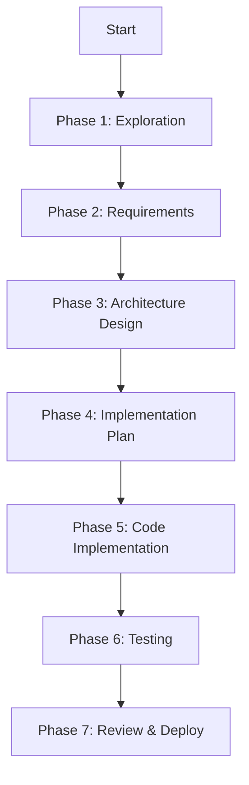

# Feature Dev Skill

Структурированный workflow для разработки новых фич с использованием 3 специализированных агентов:
- **code-explorer** — анализ кодбейза и требований
- **code-architect** — проектирование архитектуры
- **code-reviewer** — quality review реализации

**7-phase подход**: Exploration → Requirements → Design → Implementation → Testing → Review → Deploy

## Команды

### `/feature-dev`
Запускает guided feature development workflow:

```bash
/feature-dev "Add OAuth authentication"
```

**Workflow:**



### Фазы разработки

#### **Phase 1: Exploration** 🔍
**Agent**: code-explorer

Анализирует кодбейз для понимания контекста:
- Текущая архитектура проекта
- Похожие фичи (если есть)
- Integration points
- Existing patterns
- Dependencies

**Output**: Exploration Report с architecture map

#### **Phase 2: Requirements** 📋
**Agent**: code-explorer + user input

Уточняет требования:
- User stories и acceptance criteria
- Edge cases
- Non-functional requirements (performance, security)
- Out of scope
- Success metrics

**Output**: PRD (Product Requirements Document)

#### **Phase 3: Architecture Design** 🏗️
**Agent**: code-architect

Проектирует архитектуру фичи:
- Component structure
- Data models и database schema
- API contracts
- Integration points
- Migration strategy
- Rollback plan

**Output**: Architecture Design Doc + diagrams

#### **Phase 4: Implementation Plan** 📝
**Agent**: code-architect

Создаёт пошаговый план:
- Breakdown на subtasks
- Dependency order (что делать сначала)
- Estimated effort
- Risk assessment
- Testing strategy

**Output**: Implementation Checklist

#### **Phase 5: Code Implementation** 💻
**Agent**: main Claude + code-architect (consultation)

Реализация фичи:
- Создание файлов/компонентов
- Database migrations
- API endpoints
- Frontend components
- Integration code

**Output**: Working code + commits

#### **Phase 6: Testing** 🧪
**Agent**: code-reviewer

Тестирование реализации:
- Unit tests
- Integration tests
- E2E tests (если критично)
- Manual testing scenarios
- Performance validation

**Output**: Test suite + test report

#### **Phase 7: Review & Deploy** 🚀
**Agent**: code-reviewer

Финальная проверка и деплой:
- Code quality review
- CLAUDE.md compliance
- Security audit
- Documentation update
- Create PR
- Deployment checklist

**Output**: PR + deployment plan

## Использование

### Простой запуск
```bash
/feature-dev "Add user profile editing"
```

Claude проведёт через все 7 фаз с интерактивными вопросами.

### С контекстом
```bash
/feature-dev "Add OAuth authentication" --context "We already use JWT for session management"
```

### Начать с конкретной фазы
```bash
/feature-dev:design "Add OAuth" --skip-exploration
```

Начнёт сразу с Phase 3 (Design).

## Специализированные команды

### `/feature-dev:explore`
Только Phase 1 — анализ кодбейза:
```bash
/feature-dev:explore "Where should I add payment processing?"
```

### `/feature-dev:design`
Только Phase 3 — архитектурный дизайн:
```bash
/feature-dev:design "OAuth flow" --existing-components
```

### `/feature-dev:review`
Только Phase 7 — review существующей реализации:
```bash
/feature-dev:review --feature "OAuth authentication"
```

## Интеграции

### GitHub
- Создание issues для subtasks
- Pull request creation
- Branch management

### Notion
- Сохранение PRD и design docs
- Knowledge base updates

### Figma
- Design review для UI фич
- Component sync

### ln-200/ln-220 (Epic/Story Skills)
- Интеграция с existing task decomposition
- Story validation

## Принципы

- **Structured approach**: Каждая фича проходит все 7 фаз
- **Agent specialization**: Exploration, Architecture, Review — разные агенты
- **Documentation-first**: Каждая фаза производит документ
- **Incremental validation**: Проверка на каждом этапе
- **Context preservation**: Все фазы видят результаты предыдущих

## Best Practices

### 1. **Начинай с exploration**
Не пропускай Phase 1. Понимание existing code экономит время.

### 2. **Детализируй requirements**
Phase 2 — критична. Плохие requirements → переделки.

### 3. **Review architecture перед кодом**
Phase 3 review с командой → меньше архитектурных рефакторингов.

### 4. **Пиши тесты в Phase 6**
Не откладывай тесты на потом.

### 5. **Документируй решения**
Каждая фаза создаёт документ — храни их в docs/ или Notion.

## Примеры

### E-commerce: Add payment processing
```bash
/feature-dev "Add Stripe payment processing for checkout"
```

**Exploration**: Найдёт existing checkout flow, cart structure
**Requirements**: Уточнит валюты, payment methods, refund policy
**Design**: Спроектирует Stripe webhook handler, payment entity
**Plan**: Database migration → Stripe SDK → webhook → UI
**Implementation**: Код + миграции
**Testing**: Mock Stripe webhooks, test scenarios
**Review**: Security audit (PCI compliance), PR creation

### SaaS: OAuth integration
```bash
/feature-dev "Add Google OAuth authentication"
```

**Exploration**: Найдёт existing auth (JWT?), user model
**Requirements**: OAuth scopes, profile sync strategy
**Design**: OAuth flow diagram, state management
**Plan**: Backend OAuth routes → frontend callback → profile merge
**Implementation**: Passport.js integration
**Testing**: OAuth mock, edge cases
**Review**: Security review (CSRF), documentation

## Конфигурация

### Skip phases (advanced)
Если уже есть PRD:
```bash
/feature-dev --skip exploration,requirements "Feature from PRD.md"
```

### Custom agents
Можно переопределить агентов:
```bash
/feature-dev --explorer custom-explorer --architect main
```

## Метрики

Feature Dev отслеживает:
- **Time per phase** — какие фазы занимают больше времени
- **Requirements changes** — сколько раз менялись requirements после Phase 2
- **Architecture refactors** — сколько раз переделывали дизайн
- **Bugs found in review** — эффективность Phase 7

Используй `/feature-dev:stats` для аналитики.
