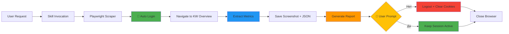
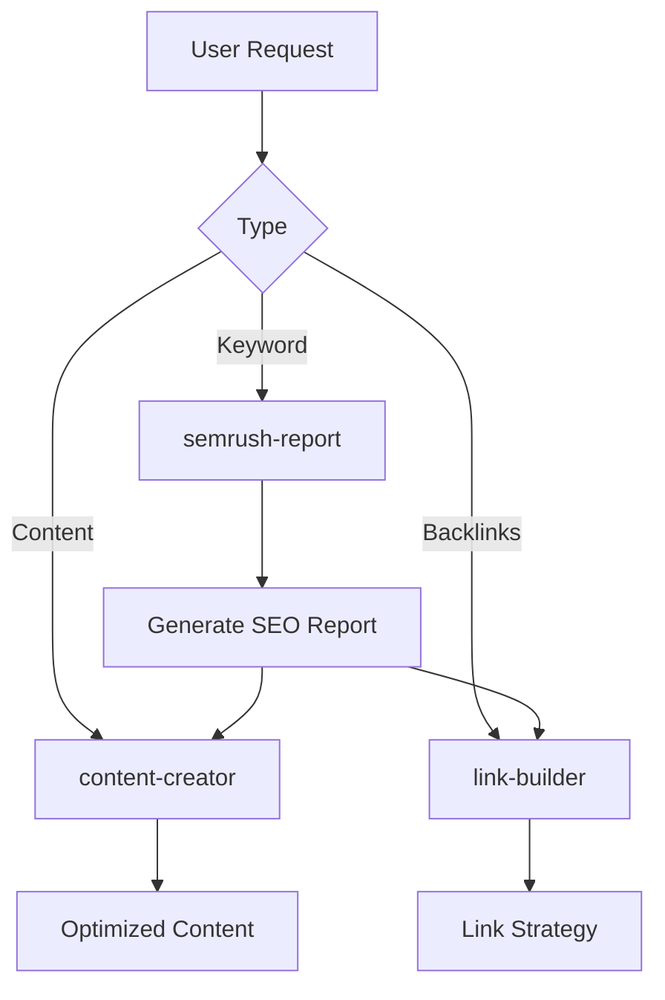

# Semrush Report Skill

Автоматизированный анализ SERP и конкурентов через Semrush с использованием браузерной автоматизации.

## 🎯 Возможности

- 🔍 **Keyword Overview** - поисковый объем, сложность, CPC, интент
- 📊 **SERP Analysis** - TOP-10 результатов с метриками (AS, backlinks, traffic)
- 🏆 **Competitor Analysis** - детальный анализ конкурентов в выдаче
- 📈 **Keyword Variations** - связанные запросы и кластеры
- 🌍 **Global Search Volume** - распределение по странам
- 🎯 **SEO Strategy** - рекомендации для ранжирования
- 📸 **Screenshots** - визуальные отчеты из Semrush

## 🔐 Аутентификация

### Credentials Location
Учетные данные хранятся в:
```
~/.ws-workspace/workspaces/my-workspace/config/semrush-credentials.json
```

**Формат:**
```json
{
  "service": "semrush",
  "credentials": {
    "email": "alexanderwirt@gmail.com",
    "password": "***"
  },
  "permissions": {
    "readonly": true,
    "no_billing_changes": true,
    "no_plan_changes": true
  }
}
```

### ⚠️ Ограничения (КРИТИЧНО)
- ✅ **ТОЛЬКО чтение** данных SERP
- ❌ **ЗАПРЕЩЕНО** изменять тариф
- ❌ **ЗАПРЕЩЕНО** делать покупки
- ❌ **ЗАПРЕЩЕНО** изменять настройки аккаунта

### 🔐 Session Management (Безопасность)

**Автоматический процесс:**
1. **Перед началом** - автоматический логин в Semrush
2. **После завершения** - интерактивный промпт:
   ```
   Вам нужен еще доступ к Semrush?
     [Y] Да - оставить сессию активной
     [N] Нет - выйти из аккаунта (рекомендуется)
   ```
3. **Если "Нет"** - автоматический logout (очистка cookies)
4. **Timeout 30 секунд** - автоматический logout для безопасности

**Опции командной строки:**
- `--keep-session` - оставить сессию активной без промпта
- `--no-prompt` - использовать defaults (auto-logout)
- `--db=de` - выбор базы данных (de, us, uk, etc.)

## 🚀 Как работает

### Архитектура


### Технический стек
- **Browser Automation:** Playwright (Node.js)
- **Browser:** Chromium (headless: false для отладки)
- **Data Extraction:** Page.evaluate() + RegEx parsing
- **Output:** JSON + PNG screenshots + Markdown report

## 📋 Использование

### Базовый запрос
```
/semrush-report Leuchtreklame berlin
```

### Запрос с параметрами
```
/semrush-report keyword="iPhone 15" database=de
```

### Анализ конкурента
```
/semrush-report domain=2penguins.de type=domain
```

## 🛠️ Рабочий процесс

### Автоматический процесс (за кулисами)

1. **Инициализация**
   ```javascript
   // Load credentials
   const creds = JSON.parse(fs.readFileSync('semrush-credentials.json'))

   // Launch browser
   const browser = await playwright.chromium.launch({ headless: false })
   ```

2. **Авторизация**
   ```javascript
   // Go to login page
   await page.goto('https://www.semrush.com/login/')

   // Auto-fill credentials
   await page.fill('input[type="email"]', creds.email)
   await page.fill('input[type="password"]', creds.password)
   await page.click('button[type="submit"]')
   ```

3. **Навигация к Keyword Overview**
   ```javascript
   const url = `https://www.semrush.com/analytics/keywordoverview/?q=${keyword}&db=${database}`
   await page.goto(url)
   await page.waitForTimeout(10000) // Wait for data load
   ```

4. **Извлечение данных**
   ```javascript
   const data = await page.evaluate(() => {
     const text = document.body.innerText

     // Extract metrics via regex
     const volume = text.match(/Suchvolumen[\s\S]{0,50}?([\d,]+)/)
     const difficulty = text.match(/Keyword-Schwierigkeit[\s\S]{0,50}?([\d]+)/)
     const cpc = text.match(/CPC[\s\S]{0,50}?([\d,]+)/)

     return { volume, difficulty, cpc, ... }
   })
   ```

5. **Сохранение результатов**
   ```javascript
   // Screenshot
   await page.screenshot({ path: 'semrush-results.png', fullPage: true })

   // JSON data
   fs.writeFileSync('semrush-data.json', JSON.stringify(data, null, 2))
   ```

6. **Session Management (Безопасность)**
   ```javascript
   // Ask user about logout
   const shouldLogout = await askUserLogout()

   if (shouldLogout) {
     // Try multiple logout methods
     await page.locator('a[href*="logout"]').click()

     // Alternative: Clear cookies
     await context.clearCookies()

     // Confirmation screenshot
     await page.screenshot({ path: 'logout-confirmation.png' })
   }
   ```

## 📊 Пример вывода

### Extracted Metrics
```json
{
  "keyword": "Leuchtreklame berlin",
  "database": "de",
  "metrics": {
    "volume": "110",
    "difficulty": "29",
    "cpc": "4.11",
    "intent": "Commercial",
    "competition": "0.96"
  },
  "organicResults": [
    {
      "position": 1,
      "domain": "altay-werbung.de",
      "as": 8,
      "backlinks": 133,
      "traffic": 21
    }
  ]
}
```

### Generated Report Sections
1. **Key Metrics** - Volume, Difficulty, CPC, Intent
2. **TOP-10 SERP** - Detailed competitor analysis
3. **Keyword Variations** - Related keywords with volume
4. **SEO Strategy** - Actionable recommendations
5. **ROI Calculation** - Commercial potential
6. **Diagrams** - Mermaid visualizations

## 🔧 Файлы и структура

### Skill Files
```
skills/semrush-report/
├── SKILL.md                    # Эта документация
└── scripts/
    └── semrush-scraper.js      # Playwright автоматизация
```

### Runtime Files (scratchpad)
```
scratchpad/
├── semrush-scraper.js          # Working script copy
├── semrush-data.json           # Extracted data
├── semrush-results.png         # Full page screenshot
├── login-page.png              # Debug screenshot
├── logout-confirmation.png     # Logout verification (if logged out)
└── package.json                # Node dependencies
```

## 🐛 Troubleshooting

### Проблема: Login failed
**Решение:**
- Скрипт откроет браузер на 45 секунд для ручного логина
- После логина скрипт продолжит автоматически

### Проблема: Metrics not extracted
**Решение:**
- Проверить `semrush-results.png` скриншот
- Semrush мог изменить структуру HTML
- Обновить RegEx селекторы в скрипте

### Проблема: Browser не закрывается
**Решение:**
- Скрипт автоматически закрывает браузер через 15 секунд
- При ошибке - 30 секунд для отладки

## 📚 Примеры запросов

### 1. Keyword Analysis
**Input:** `Leuchtreklame berlin`

**Output:**
- Search Volume: 110/месяц
- Keyword Difficulty: 29% (Легко)
- CPC: €4.11
- Intent: Commercial 100%
- TOP-10 с метриками
- 38 keyword variations

### 2. Domain Analysis (Future)
**Input:** `domain=2penguins.de`

**Output:**
- Domain Overview
- Organic keywords
- Backlink profile
- Traffic trends

### 3. SERP Features Analysis (Future)
**Input:** `keyword=iPhone 15 features=true`

**Output:**
- Featured Snippets
- People Also Ask
- Video carousel
- Image pack

## 🔄 Workflow Integration

### С другими skills



### Pipeline пример
1. **Research**: `/semrush-report Leuchtreklame berlin`
2. **Content**: Создать landing page на основе insights
3. **Links**: Найти backlink возможности из TOP-10
4. **Monitor**: Отслеживать позиции еженедельно

## 🎓 Best Practices

### Когда использовать
- ✅ Исследование новых ниш
- ✅ Анализ конкурентов перед запуском кампании
- ✅ Поиск низкоконкурентных keywords (KD < 40)
- ✅ Проверка коммерческого потенциала (CPC > €2)

### Когда НЕ использовать
- ❌ Для массового парсинга (rate limits)
- ❌ Для real-time мониторинга (кэшируемые данные)
- ❌ Для автоматического изменения настроек

## 📈 Metrics & KPIs

### Tracked Metrics
- **Search Volume** - Месячный объем поиска
- **Keyword Difficulty** - 1-100 (сложность ранжирования)
- **CPC** - Цена клика в рекламе
- **Competition Density** - 0-1 (конкуренция в ads)
- **Search Intent** - Commercial/Informational/Transactional/Navigational

### Calculated KPIs
- **SEO Opportunity Score** = (High CPC + Low KD) / Competition
- **Organic Value** = Volume × CPC × CTR
- **ROI Potential** = Organic Value / Estimated Effort

## 🔐 Security Notes

- ✅ Credentials хранятся локально (не в cloud)
- ✅ Readonly permissions enforced
- ✅ No billing/plan changes allowed
- ✅ Browser automation = same security as manual use
- ✅ **Auto-logout после работы** (user prompt)
- ✅ **30-second timeout** для auto-logout (если нет ответа)
- ✅ **Cookie clearing** как fallback для logout
- ✅ **Logout confirmation screenshot** для проверки

## 🚀 Future Enhancements

- [ ] Domain Overview scraping
- [ ] Backlink Gap analysis
- [ ] Position Tracking automation
- [ ] Scheduled reports (weekly/monthly)
- [ ] Multi-keyword batch analysis
- [ ] Export to Google Sheets
- [ ] Integration with content-creator skill

## 📞 Support

При проблемах:
1. Проверить `semrush-results.png` скриншот
2. Проверить credentials в config
3. Обновить Playwright: `npm install playwright@latest`
4. Проверить Semrush login вручную

---

**Created:** 2026-02-05
**Last Updated:** 2026-02-05
**Version:** 1.0
**Author:** Craft Agent
