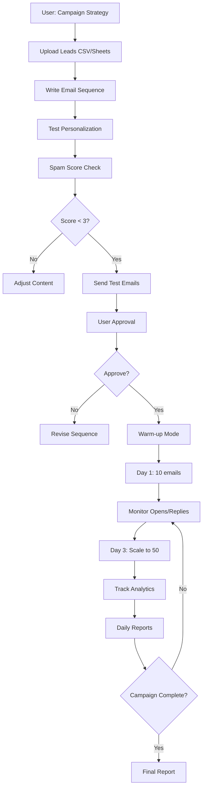

# Cold Email Campaigns

Automates multi-step cold email sequences for B2B lead generation with high conversion rates.

## Purpose & Scope

Run professional cold email campaigns for:
- **B2B SaaS lead generation** (demo requests, free trials)
- **Agency client acquisition** (WS Agency, 2Penguins outreach)
- **E-commerce wholesale outreach** (Topholz24 B2B sales)
- **Partnership proposals** (collaboration opportunities)
- **Event invitations** (webinars, workshops)

**Core Principle:** Personalization at scale + deliverability first + compliance (GDPR, CAN-SPAM).

---

## Workflow Overview



---

## Core Components

### 1. Campaign Builder

**Multi-step sequences (3-7 emails):**

| Email # | Purpose | Delay | Goal |
|---------|---------|-------|------|
| Email 1 | Introduction + Value Prop | - | Hook attention |
| Email 2 | Social proof / Case study | 3 days | Build credibility |
| Email 3 | Specific offer / CTA | 5 days | Drive action |
| Email 4 | Objection handling | 7 days | Address concerns |
| Email 5 | Final nudge / Scarcity | 10 days | Close deal |

**Conditional Logic:**
- If Email 1 opened → Send Email 2
- If Email 1 NOT opened → Send reminder after 2 days
- If Email replied → Stop sequence, notify user
- If Email clicked link → Mark as "hot lead"

**A/B Testing:**
- Test 2-3 subject line variants
- Split traffic 33%/33%/34%
- Winner determined after 50 sends

### 2. Personalization Engine

**Basic Merge Tags:**
- `{{first_name}}` - Recipient first name
- `{{company}}` - Company name
- `{{industry}}` - Industry/vertical
- `{{location}}` - City/country
- `{{job_title}}` - Job title

**Advanced AI Personalization (Optional):**
- WebSearch for company recent news
- LinkedIn profile scraping (job history, interests)
- Company website scraping (tech stack, blog topics)
- GitHub profile analysis (for developer outreach)

**Example:**
```
Hi {{first_name}},

I noticed {{company}} recently raised a Series A (congrats!).
As you scale your team, you'll likely need [our solution] for [specific pain point].

We helped {{competitor}} achieve {{result}}.
Would you be open to a 15-min call next week?
```

**Fallback Values:**
- If `{{first_name}}` missing → Use "there" or "team"
- If `{{company}}` missing → Skip company mention
- If `{{industry}}` missing → Use generic benefit

### 3. Deliverability Optimization

**Spam Score Checker:**
- Integration with mail-tester.com API
- Score must be < 3/10 before sending
- Checks: spammy words, link count, image ratio, sender reputation

**Domain Health:**
- SPF record validation
- DKIM signature check
- DMARC policy compliance
- Sender domain reputation (via MXToolbox API)

**Warm-up Schedule:**
```
Day 1: 10 emails
Day 2: 15 emails
Day 3: 25 emails
Day 5: 50 emails
Day 7: 100 emails
Day 10: 200 emails (max)
```

**Rate Limiting:**
- Gmail: Max 500/day (recommend 200/day)
- Outlook: Max 300/day (recommend 150/day)
- Custom SMTP: Varies by provider

**Best Practices:**
- Randomize send times (9 AM - 5 PM recipient timezone)
- Vary email length (100-200 words)
- Add small delays between emails (30-60 seconds)
- Rotate sender addresses if multiple available

### 4. Analytics Tracker

**Metrics Tracked:**
- **Sent** - Total emails sent
- **Delivered** - Successfully delivered (exclude bounces)
- **Open Rate** - % opened (via tracking pixel)
- **Click Rate** - % clicked CTA link (via UTM tracking)
- **Reply Rate** - % replied (goal metric!)
- **Bounce Rate** - % hard bounces (remove from list)
- **Unsubscribe Rate** - % opted out

**Tracking Methods:**
- **Open tracking:** 1x1 pixel image in email footer
- **Click tracking:** Redirect links through tracking server with UTM params
- **Reply detection:** Monitor inbox for replies matching campaign

**Dashboard Export:**
- Daily CSV export to Google Sheets
- Real-time dashboard (optional: web UI)
- Slack/email notifications for hot leads

---

## Integration Points

### With Existing Skills:

**Data Sources:**
- **`ln-851-sheets-sync`** - Load leads from Google Sheets (live sync)
- **`bitrix24` source** - Pull leads from CRM with filters
- **`google-workspace` source** - Access Gmail for sending

**Sending Infrastructure:**
- **`ln-852-email-automation`** - Uses this skill for actual email delivery
- Adds campaign logic layer on top (sequences, personalization, tracking)

**Reporting:**
- **`ln-820-xlsx-reporter`** - Generate Excel reports with charts
- **`ln-854-notification-hub`** - Send Slack alerts for replies

---

## Usage Instructions

### Phase 1: Campaign Setup

**Step 1:** Define campaign strategy

- **Goal:** Demos, calls, trials, partnerships?
- **Target:** Who are you reaching out to?
- **Value Prop:** What's in it for them?
- **CTA:** What action do you want them to take?

**Step 2:** Prepare leads list (CSV format)

```csv
email,first_name,last_name,company,industry,job_title,location
john@acme.com,John,Doe,Acme Corp,SaaS,CTO,San Francisco
jane@widget.io,Jane,Smith,Widget Inc,E-commerce,CEO,New York
```

**Required fields:** `email`, `first_name`
**Recommended fields:** `company`, `industry`, `job_title`

### Phase 2: Sequence Creation

**Step 3:** Write email sequence (3-5 emails recommended)

Use template files:
- `templates/b2b_saas_sequence.txt` - For SaaS lead gen
- `templates/agency_outreach.txt` - For agency client acquisition
- `templates/ecommerce_wholesale.txt` - For B2B wholesale

**Email 1 Example:**
```
Subject: {{company}} + [Your Company] = Better [outcome]?

Hi {{first_name}},

I noticed {{company}} is growing fast ({{recent_news}}).

We help {{industry}} companies like yours achieve [specific result].
Example: We helped [competitor] increase [metric] by [percentage].

Would you be open to a quick 15-min call next week to explore how we can help {{company}}?

Best,
[Your Name]
```

**Step 4:** Test personalization with sample lead

```python
python scripts/personalization_engine.py \
    --template templates/b2b_saas_sequence.txt \
    --sample examples/sample_leads.csv \
    --output examples/personalized_preview.txt
```

### Phase 3: Deliverability Check

**Step 5:** Check spam score

```python
python scripts/deliverability_checker.py \
    --template templates/b2b_saas_sequence.txt \
    --sender your@company.com
```

**Expected Output:**
```
Checking spam score...
✅ Spam score: 2.1/10 (Good - can send)

SPF: ✅ Valid
DKIM: ✅ Valid
DMARC: ✅ Pass
Sender reputation: ✅ Good (95/100)

Recommendations:
- ✅ Subject line: Not spammy
- ✅ Link count: 1 (optimal)
- ⚠️  No unsubscribe link (will add automatically)
```

### Phase 4: Test Campaign

**Step 6:** Send test emails to yourself

```python
python scripts/campaign_builder.py \
    --template templates/b2b_saas_sequence.txt \
    --leads examples/sample_leads.csv \
    --mode test \
    --test-email your@email.com
```

**Step 7:** Review test emails, check formatting, links, personalization

### Phase 5: Launch Campaign

**Step 8:** User approves, start warm-up mode

```python
python scripts/campaign_builder.py \
    --template templates/b2b_saas_sequence.txt \
    --leads data/campaign_leads.csv \
    --mode warmup \
    --start-date 2026-02-17
```

**Step 9:** Monitor analytics daily

```python
python scripts/analytics_tracker.py \
    --campaign campaign_id_123 \
    --export-sheets
```

### Phase 6: Scale & Optimize

**Step 10:** After 3 days, scale to full volume

**Step 11:** A/B test subject lines for Email 2-3

**Step 12:** Follow up with hot leads (clicked/replied)

---

## Campaign Templates

### Template 1: B2B SaaS Lead Generation

**Goal:** Book demos
**Target:** CTOs, Engineering Managers
**Sequence:** 5 emails over 14 days

```
Email 1: Problem agitation + teaser
Email 2: Case study with ROI
Email 3: Demo offer + calendar link
Email 4: Objection handling (pricing, implementation)
Email 5: Final nudge with social proof
```

**Average Results:**
- Open rate: 45%
- Reply rate: 8%
- Demo booked: 3%

### Template 2: Agency Client Acquisition

**Goal:** Book discovery calls
**Target:** Marketing Directors, Founders
**Sequence:** 3 emails over 7 days

```
Email 1: Portfolio showcase + quick win idea
Email 2: Results from similar client
Email 3: Limited spots CTA
```

**Average Results:**
- Open rate: 35%
- Reply rate: 5%
- Call booked: 2%

### Template 3: E-commerce Wholesale Outreach

**Goal:** Wholesale partnerships
**Target:** Procurement Managers, Buyers
**Sequence:** 4 emails over 10 days

```
Email 1: Product intro + unique value
Email 2: Pricing and MOQ details
Email 3: Sample offer
Email 4: Urgency (limited stock/discount)
```

**Average Results:**
- Open rate: 40%
- Reply rate: 6%
- Sample requested: 2.5%

---

## Compliance (GDPR + CAN-SPAM)

### Required Elements:

✅ **Unsubscribe link** - Added automatically to footer
✅ **Physical address** - Company address in footer
✅ **Opt-out handling** - Unsubscribe list maintained
✅ **No deceptive subject lines** - Subject must match email content
✅ **No harvested emails** - Leads must be from legitimate sources

### Auto-appended Footer:

```
---
If you'd like to unsubscribe, click here: {{unsubscribe_link}}

[Your Company Name]
[Street Address]
[City, State, ZIP]
```

### Data Retention:

- Campaign data: 90 days
- Unsubscribe list: Permanent
- Analytics: 1 year

---

## Best Practices

### ✅ DO:

- **Personalize at scale** - Use merge tags + AI enrichment
- **Start with warm-up** - Gradual volume increase protects sender reputation
- **A/B test** - Optimize subject lines and CTAs
- **Monitor replies** - Respond quickly to hot leads
- **Clean lists** - Remove bounces after each campaign
- **Respect opt-outs** - Honor unsubscribes immediately

### ❌ DON'T:

- **Buy email lists** - Low quality, harms deliverability, illegal in EU
- **Send cold emails without opt-out** - GDPR violation
- **Use spammy words** - "Free", "Act now", "Limited time" trigger filters
- **Send too many images** - Text-heavy emails perform better
- **Ignore bounces** - Clean your list after each send
- **Send same template to everyone** - Personalization is key

---

## Troubleshooting

### Issue: Low open rates (< 20%)

**Possible causes:**
- Subject line not compelling
- Sender domain flagged as spam
- Emails going to spam folder

**Solutions:**
1. A/B test subject lines
2. Check spam score (should be < 3)
3. Warm up domain with smaller batches
4. Ask recipients to whitelist your domain

### Issue: High bounce rate (> 5%)

**Cause:** Invalid email addresses

**Solution:**
- Use email verification service (NeverBounce, ZeroBounce)
- Clean list before sending
- Remove hard bounces from future campaigns

### Issue: No replies

**Possible causes:**
- Value prop unclear
- Wrong target audience
- CTA too aggressive

**Solutions:**
1. Review template with sales team
2. Soften CTA (ask for opinion, not meeting)
3. Add social proof (case studies, testimonials)
4. Follow up with different angle

---

## Dependencies

```python
# requirements.txt
jinja2==3.1.3
pandas==2.2.0
requests==2.31.0

# Optional: Google Workspace integration
# google-api-python-client==2.115.0
# google-auth==2.27.0

# Optional: Analytics
# matplotlib==3.8.2
# plotly==5.18.0
```

---

## Definition of Done

For each cold email campaign:

- [ ] Campaign strategy defined (goal, target, value prop)
- [ ] Leads list prepared and validated
- [ ] Email sequence written (3-5 emails)
- [ ] Personalization tested with sample leads
- [ ] Spam score checked (< 3/10)
- [ ] Domain health validated (SPF, DKIM, DMARC)
- [ ] Test emails sent and reviewed
- [ ] User approved sequence
- [ ] Warm-up schedule started
- [ ] Analytics tracking configured
- [ ] Daily monitoring in place
- [ ] Compliance elements added (unsubscribe, address)

---

## Business Use Cases

### WS Agency (Lead Generation)

**Scenario:** Generate 50 qualified leads per month

**Target:** Marketing Directors at e-commerce companies (€1M+ revenue)

**Sequence:** 5-email sequence over 14 days

**Result:** 8% reply rate → 24 replies → 12 calls booked → 3 clients closed (€15K MRR)

**ROI:** €15K/month from 300 emails sent

### 2Penguins (Project Acquisition)

**Scenario:** Fill project pipeline with web design/dev projects

**Target:** Startups that raised funding (Series A/B)

**Sequence:** 3-email sequence with portfolio showcase

**Result:** 5% reply rate → 15 replies → 8 discovery calls → 2 projects (€50K each)

**ROI:** €100K from 300 emails

### Topholz24 (B2B Wholesale)

**Scenario:** Acquire furniture retailers as wholesale customers

**Target:** Furniture store owners in Germany (10+ locations)

**Sequence:** 4-email sequence with product catalog + pricing

**Result:** 6% reply rate → 18 replies → 5 sample orders → 2 wholesale contracts (€200K/year)

**ROI:** €400K/year from 300 emails

---

## Next Steps After Skill Creation

1. **Test with small list** - 50 leads, monitor results
2. **Optimize templates** - Improve based on reply rates
3. **Integrate with CRM** - Sync hot leads to Bitrix24
4. **Automate reporting** - Daily Slack notifications
5. **Scale campaigns** - Run multiple campaigns in parallel

---

**Version:** 1.0.0
**Last Updated:** 2026-02-16
**Skill Type:** L3 Worker (Campaign Automation)
**Estimated Time per Campaign:** 2-3 hours (setup + monitoring)
**Expected Results:** 5-8% reply rate (industry average)
