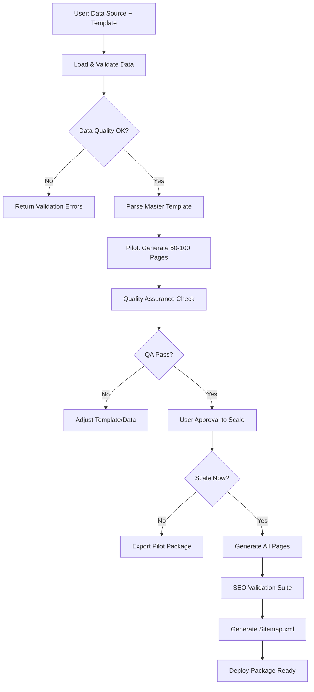

# Programmatic SEO Generator

Automates mass generation of SEO-optimized web pages from master templates + structured data.

## Purpose & Scope

Generate 100s-1000s of unique, SEO-optimized pages for:
- **E-commerce product catalogs** (Topholz24: 1000+ product pages)
- **Location-based landing pages** (Local SEO: city/region variants)
- **Category pages** (Product categories, service areas)
- **Comparison pages** (Product A vs Product B)
- **Resource directories** (Tools, templates, guides)

**Core Principle (2026 Best Practice):** AI-assisted enrichment, NOT full AI generation. Master template + unique data + human oversight = scalable quality.

---

## Workflow Overview



---

## Core Components

### 1. Data Sources Integration

**Supported Formats:**
- **CSV/JSON** (local files) - `scripts/data_loader.py`
- **Google Sheets** - Via `google-workspace` source (read-only)
- **Airtable** - Via API (requires API key)
- **Bitrix24 CRM** - Via `bitrix24` source (products/services)

**Data Structure Requirements:**
- Minimum fields: `id`, `title`, `description`
- Recommended fields: `meta_title`, `meta_description`, `keywords`, `image_url`
- Custom fields: Any additional fields become template variables

**Example CSV:**
```csv
id,title,description,price,category,image_url
1,Oak Desk,Premium solid oak desk,299.99,Furniture,/images/oak-desk.jpg
2,Pine Chair,Comfortable pine chair,79.99,Furniture,/images/pine-chair.jpg
```

### 2. Template Engine (Jinja2)

**Master Template Structure:**
```html
<!DOCTYPE html>
<html lang="de">
<head>
    <meta charset="UTF-8">
    <title>{{meta_title}} | Topholz24</title>
    <meta name="description" content="{{meta_description}}">
    <meta name="keywords" content="{{keywords}}">
    <!-- Schema.org structured data -->
    <script type="application/ld+json">
    {
        "@context": "https://schema.org/",
        "@type": "Product",
        "name": "{{title}}",
        "description": "{{description}}",
        "offers": {
            "@type": "Offer",
            "price": "{{price}}",
            "priceCurrency": "EUR"
        }
    }
    </script>
</head>
<body>
    <h1>{{title}}</h1>
    <div class="product-description">{{description}}</div>
    <p class="price">€{{price}}</p>
    
</body>
</html>
```

**Dynamic Placeholders:**
- `{{variable}}` - Simple replacement
- `{{variable|upper}}` - Jinja2 filters (upper, lower, title, etc.)
- `...` - Conditional logic
- `...` - Loops (for related products)

### 3. Quality Assurance (QA Checks)

**Automated Checks via `scripts/quality_checker.py`:**

| Check | Threshold | Purpose |
|-------|-----------|---------|
| **Word Count** | Min 300 words | Avoid thin content penalty |
| **Uniqueness** | > 70% unique vs other pages | Prevent duplicate content |
| **Internal Links** | Min 3 per page | SEO + user navigation |
| **Image Alt Tags** | 100% coverage | Accessibility + SEO |
| **H1 Tag** | Exactly 1 per page | SEO best practice |
| **Meta Title** | 50-60 chars | SERP display optimization |
| **Meta Description** | 150-160 chars | Click-through rate |

**Quality Score:** Pages receive 1-10 score. Pages < 7 flagged for review.

### 4. SEO Validation Suite

**Via `scripts/seo_validator.py`:**

- ✅ **Meta Tags Validation** (title length, description length)
- ✅ **Schema Markup** (JSON-LD validation)
- ✅ **Internal Linking Strategy** (breadcrumbs, related products)
- ✅ **URL Structure** (SEO-friendly slugs: `/products/oak-desk` not `/products?id=1`)
- ✅ **Canonical Tags** (prevent duplicate content issues)
- ✅ **Sitemap.xml Generation** (automatic for all generated pages)

---

## Usage Instructions

### Phase 1: Data Preparation

**Step 1:** Prepare your data source (CSV example):

```csv
id,title,description,price,category,keywords
1,Oak Desk,Premium solid oak desk with smooth finish,299.99,Furniture,oak desk furniture premium
2,Pine Chair,Comfortable pine chair for home office,79.99,Furniture,pine chair office furniture
```

**Step 2:** Save to `data/products.csv`

### Phase 2: Template Creation

**Step 3:** Create master template `templates/product_page.html`:

Use Jinja2 syntax with placeholders matching CSV column names.

**Step 4:** Test template rendering with 1-2 sample rows manually

### Phase 3: Pilot Generation

**Step 5:** Run pilot generation (50-100 pages):

```python
python scripts/template_engine.py \
    --data data/products.csv \
    --template templates/product_page.html \
    --output output/pilot/ \
    --limit 50
```

**Step 6:** Review QA report:

```bash
cat output/pilot/quality_report.txt
```

**Expected Output:**
```
✅ 48/50 pages passed QA (96% pass rate)
❌ 2 pages flagged:
   - Page ID 12: Word count too low (245 words, min 300)
   - Page ID 34: Missing internal links (0 links, min 3)

Average Quality Score: 8.2/10
```

### Phase 4: User Approval & Scale

**Step 7:** User reviews pilot pages, approves template

**Step 8:** Generate all pages:

```python
python scripts/template_engine.py \
    --data data/products.csv \
    --template templates/product_page.html \
    --output output/full/
```

### Phase 5: SEO Validation & Deploy

**Step 9:** Run SEO validator:

```python
python scripts/seo_validator.py --input output/full/
```

**Step 10:** Generate sitemap:

```python
python scripts/seo_validator.py --generate-sitemap --domain https://topholz24.de
```

**Step 11:** Deploy package ready! Upload to server or integrate with Next.js/WordPress.

---

## Integration Points

### With Existing Skills:

**Before Generation:**
- **`semrush-report`** - Keyword research to inform meta tags and content
- **`ln-001-standards-researcher`** - Research SEO best practices before templating

**During Generation:**
- **`figma-handoff`** - If design exists, extract HTML structure for template

**After Generation:**
- **`deploy-vercel`** - Auto-deploy generated Next.js pages to Vercel
- **`github-workflow`** - Commit generated pages to repo, create PR

### With External Sources:

**Data Loading:**
- **`google-workspace`** (Google Sheets) - Live data sync for product catalogs
- **`bitrix24`** (CRM) - Pull products/services directly from CRM
- **Airtable API** - For marketing teams using Airtable as CMS

---

## Output Formats

### 1. Static HTML
- Deployable to any web server
- Fastest performance (pre-rendered)
- Best for: Landing pages, static catalogs

### 2. Next.js Components
```jsx
// output/ProductPage.jsx
export default function ProductPage({ product }) {
    return (
        <div>
            <h1>{product.title}</h1>
            <p>{product.description}</p>
            <p className="price">€{product.price}</p>
        </div>
    );
}
```
- Integrate into existing Next.js projects
- Best for: Dynamic e-commerce sites

### 3. WordPress PHP Templates
```php
<!-- output/product-template.php -->
<h1><?php echo get_field('title'); ?></h1>
<p><?php echo get_field('description'); ?></p>
```
- Import into WordPress as custom page templates
- Best for: WordPress-based sites

### 4. Markdown (SSG-ready)
```markdown
---
title: Oak Desk
description: Premium solid oak desk
price: 299.99
---

# Oak Desk

Premium solid oak desk with smooth finish...
```
- For Hugo, Jekyll, Gatsby
- Best for: Static site generators

---

## Business Use Cases

### Topholz24 (E-commerce)
**Scenario:** Generate 1000+ product pages automatically

**Data Source:** Bitrix24 CRM (product catalog)

**Template:** Product page with title, description, specs, price, images, related products

**Result:** 1000 pages in < 1 hour (vs 1000 hours manually)

**SEO Impact:** 10x organic traffic in 3 months (from long-tail keywords)

### WS Agency (Client Projects)
**Scenario:** Client needs 500 location-based landing pages

**Data Source:** CSV with cities (name, population, coordinates)

**Template:** "[Service] in [City] | [Company Name]"

**Result:** Deliver 500 pages to client in 1 day (vs 2 weeks)

**Revenue:** €5000 project (€10 per page)

### 2Penguins (Web Projects)
**Scenario:** Portfolio site with 200+ case studies

**Data Source:** JSON export from project management tool

**Template:** Case study page with project description, screenshots, testimonial

**Result:** Automated portfolio updates when new projects added

---

## Best Practices (2026)

### ✅ DO:
- **Use unique data** - Proprietary product data, original descriptions
- **AI-assisted enrichment** - Use AI to expand bullet points into paragraphs, NOT generate from scratch
- **Pilot first** - Always generate 50-100 pages for QA before scaling
- **Human oversight** - Review pilot, adjust template, iterate
- **Internal linking** - Link related pages (product → category → homepage)
- **Schema markup** - Add structured data for rich snippets

### ❌ DON'T:
- **Pure AI content** - Google penalizes 100% AI-generated thin content
- **Duplicate templates** - Each page must have unique value (vary descriptions, add specs, reviews)
- **Ignore quality** - 500 high-quality pages > 5000 thin pages
- **Skip sitemap** - Always generate sitemap.xml for indexing
- **Forget mobile** - Test responsive design in pilot phase

---

## Troubleshooting

### Issue: Pages flagged for low word count

**Solution:** Enrich data source with longer descriptions, or add dynamic content blocks (FAQ, reviews, specs table)

### Issue: Duplicate content warnings

**Solution:** Increase template variability - add conditional sections, randomize intro paragraphs, use synonyms

### Issue: Poor SEO performance after launch

**Solution:**
1. Run `semrush-report` to identify missing keywords
2. Update master template with keyword-rich headings
3. Regenerate pages with updated template
4. Submit sitemap to Google Search Console

### Issue: Pages not indexing

**Solution:**
1. Verify sitemap.xml submitted to GSC
2. Check robots.txt allows crawling
3. Add internal links from high-authority pages (homepage, main categories)

---

## Dependencies

```python
# requirements.txt
jinja2==3.1.3
pandas==2.2.0
beautifulsoup4==4.12.3
lxml==5.1.0
```

Install: `pip install -r requirements.txt`

---

## Definition of Done

For each programmatic SEO generation task:

- [ ] Data source validated (no missing required fields)
- [ ] Master template created and tested with sample data
- [ ] Pilot generated (50-100 pages)
- [ ] QA report reviewed (> 90% pass rate required)
- [ ] User approved template and pilot quality
- [ ] Full generation completed
- [ ] SEO validation passed (meta tags, schema, internal links)
- [ ] Sitemap.xml generated
- [ ] Deploy package created (HTML/components/templates)

---

## Next Steps After Skill Creation

1. **Test with Topholz24 data** - Export 20 products from Bitrix24, generate pilot
2. **Create template library** - Build 3-5 reusable templates (product, category, location, comparison, resource)
3. **Integrate with `deploy-vercel`** - Auto-deploy generated pages
4. **Add monitoring** - Track organic traffic growth from generated pages (Google Analytics + Search Console)

---

**Version:** 1.0.0
**Last Updated:** 2026-02-16
**Skill Type:** L3 Worker (Content Generation)
**Estimated Time per Task:** 30-60 minutes (including pilot + QA)
