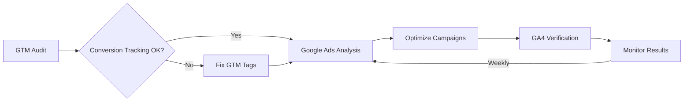

# Google Marketing Suite

**Complete Google Marketing automation suite** for managing Google Tag Manager, Google Ads, and Google Analytics 4 through browser automation.

## Overview

Professional-grade skills for digital marketing agencies and businesses managing multiple client accounts. Built on **official Google documentation (2026)** with comprehensive workflows for audit, analysis, and optimization.

## Skills Included

### 1. `/google-tag-manager`
**GTM Audit & Management**

Comprehensive Google Tag Manager audit, debugging, and tag management.

**Core Capabilities:**
- ✅ GTM container audit (tags, triggers, variables)
- ✅ Tag firing verification via Preview Mode
- ✅ DataLayer implementation check
- ✅ Conversion tracking audit (Google Ads, GA4)
- ✅ Cross-domain tracking verification
- ✅ Generate audit reports with datatable visualization

**Use Cases:**
- New client GTM audit
- Conversion tracking verification
- GA4 e-commerce tracking audit
- DataLayer implementation review

---

### 2. `/google-ads-manager`
**Complete Google Ads Management**

Full Google Ads campaign management extending analysis with editing capabilities.

**Core Capabilities:**
- ✅ **Analysis**: YoY performance, ROAS, CPA, CTR calculations
- ✅ **Campaign editing**: Pause/enable, budget changes, bidding strategy
- ✅ **Keyword management**: Add negative keywords, pause underperformers
- ✅ **Ad management**: Create/pause ads, update ad copy
- ✅ **Budget optimization**: Recommend and apply budget reallocations

**Use Cases:**
- Weekly optimization routine
- Budget reallocation
- Search terms cleanup (negative keywords)
- Ad copy A/B testing
- Campaign health check

---

### 3. `/google-analytics`
**GA4 Traffic & Conversion Analysis**

Google Analytics 4 data analysis through browser automation.

**Core Capabilities:**
- ✅ **Traffic analysis**: Sources, geography, demographics, device
- ✅ **Conversion analysis**: Funnel visualization, drop-off analysis
- ✅ **User behavior**: Page engagement, user journey, session duration
- ✅ **E-commerce performance**: Product performance, AOV, transactions
- ✅ **Audience insights**: Demographics, LTV analysis

**Use Cases:**
- Monthly traffic reports
- Conversion funnel optimization
- Product performance analysis
- User lifetime value (LTV) analysis
- Real-time event monitoring

---

## Prerequisites

### Required Source
- **browser-agent**: Installed and configured

### Browser Profiles
All skills work with **any authenticated browser profile**:
- Skills auto-detect available profiles at runtime
- Select profile with access to client accounts
- Typical profiles: Marketing team profiles, agency profiles

### Knowledge Bases
Three comprehensive reference guides included in session data:
1. **Google Tag Manager Knowledge Base** - GTM API, UI workflows, best practices
2. **Google Ads Knowledge Base** - Campaign types, bidding, API operations
3. **Google Analytics 4 Knowledge Base** - GA4 events, implementation, analysis

Based on **official Google documentation (2026)**:
- [Google Tag Manager Developer Guide](https://developers.google.com/tag-platform/tag-manager/api/v2/devguide)
- [Google Ads API Documentation](https://developers.google.com/google-ads/api)
- [GA4 Events Reference](https://developers.google.com/analytics/devguides/collection/ga4/reference/events)

---

## Quick Start

### Weekly Marketing Routine

**Monday Morning (30-60 min):**

1. **Google Ads Analysis** (`/google-ads-manager`)
   - Analyze last 7 days performance
   - Identify underperformers (low ROAS, high CPA)
   - Add negative keywords from search terms
   - Generate client report

2. **GA4 Traffic Check** (`/google-analytics`)
   - Review traffic sources
   - Check conversion funnel
   - Identify top/bottom products
   - Note optimization opportunities

3. **GTM Verification** (`/google-tag-manager`) - as needed
   - Verify conversion tags after changes
   - Check dataLayer implementation
   - Audit new client setups

### Monthly Deep Dive

**First week of month:**

1. **Full GTM Audit** - New clients or major changes
2. **Google Ads Health Check** - All campaigns review
3. **GA4 Monthly Report** - Traffic, conversions, LTV analysis
4. **Budget Optimization** - Reallocate based on ROAS

---

## Integration Workflow

**Cross-skill workflow example:**

**Workflow steps:**
1. **GTM**: Verify conversion tracking works
2. **Google Ads**: Analyze performance, optimize
3. **GA4**: Cross-check conversions, analyze user behavior
4. **Iterate**: Weekly optimization cycle

---

## Features

### ✅ Multi-Profile Support
- Works with **any browser profile** (not hardcoded)
- Auto-detects available profiles
- Select appropriate profile per client

### ✅ Visual Reports
- **DataTable** integration for structured data
- Screenshot capture for documentation
- Client-ready reports generation

### ✅ Official Documentation
- Built on **Google's official 2026 documentation**
- Comprehensive workflows tested on real accounts
- Best practices from Google

### ✅ Agency-Friendly
- Manage **multiple client accounts**
- Scale across 10s-100s of clients
- Standardized processes

---

## Use Cases by Business Type

### **Digital Marketing Agencies**
- Manage 10-50+ client accounts
- Weekly optimization routines
- Standardized audit processes
- Client reporting automation

### **E-commerce Businesses**
- Product performance tracking
- Conversion funnel optimization
- ROAS improvement
- Shopping behavior analysis

### **B2B Companies**
- Lead generation tracking
- Campaign ROI analysis
- Attribution modeling
- Audience insights

### **In-House Marketing Teams**
- Campaign health monitoring
- Budget optimization
- Performance benchmarking
- Competitive analysis

---

## Technical Details

### Architecture
- **Browser automation** via browser-agent MCP source
- **UI-based operations** (no API keys required initially)
- **Future-ready**: Designed for eventual API integration

### Browser Compatibility
- Chrome/Chromium-based browsers
- Multiple profile support
- Cookie/session management

### Performance
- **GTM Audit**: 15-30 min (full container)
- **Google Ads Analysis**: 10-20 min (per account)
- **GA4 Traffic Report**: 10-15 min

---

## Roadmap

### Short-term (1-2 months)
- [ ] Refine workflows based on user feedback
- [ ] Add more automation patterns
- [ ] Expand use case library

### Medium-term (3-6 months)
- [ ] **Google Ads API integration** (MCP source)
- [ ] **GA4 API integration** (MCP source)
- [ ] Automated weekly reports
- [ ] Slack/email notifications

### Long-term (6-12 months)
- [ ] **Autonomous marketing agent**
- [ ] AI-powered optimization recommendations
- [ ] Cross-platform attribution
- [ ] Predictive analytics

---

## Support

**Documentation:**
- Individual SKILL.md files for each skill
- Knowledge bases in session data folder
- Official Google documentation links

**GitHub:**
- Skills Library: [skills-library-sync](https://github.com/your-org/skills-library-sync)
- Report issues, contribute improvements

---

## License

Created by **WS Agency** for the WS Workspace skills library.

Based on official Google documentation and best practices. All trademarks belong to their respective owners.

---

## Credits

**Author:** WS Workspace
**Version:** 1.0.0
**Last Updated:** February 22, 2026
**Category:** L8 Marketing

**Built with:**
- Official Google Tag Manager documentation
- Official Google Ads API documentation
- Official Google Analytics 4 documentation
- Real-world agency workflows
