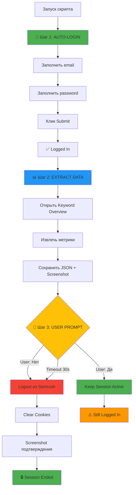

# Session Management - Безопасная работа с Semrush

## 🔐 Как это работает

### Автоматический процесс



---

## 📝 Пример работы

### 1. Запуск анализа
```bash
node semrush-scraper.js "Leuchtreklame berlin"
```

### 2. Автоматический логин
```
🔐 STEP 1: LOGIN TO SEMRUSH
✅ Email filled
✅ Password filled
✅ Login submitted
✅ Successfully logged in to Semrush
```

### 3. Извлечение данных
```
📊 STEP 2: EXTRACT SERP DATA
🔍 Loading keyword: "Leuchtreklame berlin"
🌍 Database: DE
📸 Results screenshot saved
✅ Data saved to semrush-data.json
```

### 4. Интерактивный промпт
```
============================================================
🔐 SESSION MANAGEMENT
============================================================

Вам нужен еще доступ к Semrush?
  [Y] Да - оставить сессию активной
  [N] Нет - выйти из аккаунта (рекомендуется)

Ваш выбор (Y/N): _
```

### 5a. Если выбрали "N" (рекомендуется)
```
🔐 STEP 3: LOGOUT FROM SEMRUSH
🔐 Logging out from Semrush...
✅ Logout clicked
✅ Successfully logged out from Semrush
🔒 Session ended - your account is secure
📸 Logout confirmation screenshot saved
```

### 5b. Если выбрали "Y"
```
🔓 SESSION KEPT ACTIVE
⚠️ You are still logged in to Semrush
💡 Remember to log out manually when done!
```

### 6. Завершение
```
⏸️ Browser will close in 5 seconds...

============================================================
✅ SEMRUSH ANALYSIS COMPLETE
============================================================

📁 Output files:
  • semrush-data.json - Extracted metrics
  • semrush-results.png - Full page screenshot
  • logout-confirmation.png - Logout confirmation
```

---

## ⚡ Быстрый старт

### Базовое использование (с auto-logout)
```bash
node semrush-scraper.js "Leuchtreklame berlin"
# Скрипт спросит о logout после работы
```

### Оставить сессию активной
```bash
node semrush-scraper.js "iPhone 15" --keep-session
# Не будет logout - сессия останется активной
```

### Другая база данных
```bash
node semrush-scraper.js "iPhone 15" --db=us
# Использовать US базу данных
```

### Auto-logout без промпта
```bash
node semrush-scraper.js "Leuchtreklame berlin" --no-prompt
# Автоматически выйти без вопросов
```

---

## 🔒 Безопасность

### ✅ Рекомендуется

**Всегда выбирайте "N" (logout) после работы, если:**
- Завершили все анализы
- Работаете на публичном/общем компьютере
- Не планируете новые запросы в ближайшие минуты
- Хотите максимальную безопасность

### ⚠️ Keep Session только если:
- Планируете несколько запросов подряд
- Работаете на личном защищенном компьютере
- Сэкономите время на повторных логинах

### 🔐 Что происходит при logout:

1. **Клик по Logout** (multiple selectors)
   ```javascript
   'a[href*="logout"]'
   'button:has-text("Log out")'
   '.user-menu a:has-text("Log out")'
   ```

2. **Fallback: Clear Cookies** (если кнопка не найдена)
   ```javascript
   await context.clearCookies()
   ```

3. **Verification Screenshot**
   ```
   logout-confirmation.png
   ```

---

## ⏰ Timeout Protection

**Если не ответите на промпт за 30 секунд:**
```
⏰ Timeout (30s) - performing auto-logout for security...
```

Скрипт **автоматически выполнит logout** для защиты вашего аккаунта.

---

## 📊 Output Files

### При успешном logout
```
scratchpad/
├── semrush-data.json           # Extracted metrics
├── semrush-results.png         # Full SERP screenshot
├── login-page.png              # Login verification
└── logout-confirmation.png     # Logout verification ✅
```

### При keep-session
```
scratchpad/
├── semrush-data.json           # Extracted metrics
├── semrush-results.png         # Full SERP screenshot
└── login-page.png              # Login verification
```
(Нет logout-confirmation.png)

---

## 🐛 Troubleshooting

### Logout не работает
```
⚠️ Logout button not found, clearing cookies...
✅ Cookies cleared
```
Это fallback метод - ваша сессия все равно завершена.

### Проверить logout вручную
1. Откройте `logout-confirmation.png`
2. Должна быть видна login page или logout success

### Если сомневаетесь
Откройте Semrush вручную в браузере:
- Если просит логин → logout успешен ✅
- Если открывается dashboard → logout failed ❌

---

## 💡 Best Practices

### ✅ DO
- Выбирайте "N" (logout) по умолчанию
- Проверяйте `logout-confirmation.png` после работы
- Используйте `--no-prompt` для автоматизации
- Логаут после каждой сессии на shared computers

### ❌ DON'T
- Не оставляйте сессию активной без необходимости
- Не игнорируйте timeout промпт
- Не закрывайте браузер вручную (дождитесь auto-close)

---

## 📚 Примеры сценариев

### Scenario 1: Single Query (Recommend: Logout)
```bash
node semrush-scraper.js "best CRM software"
# Prompt: N (logout)
# Reason: Одноразовый анализ
```

### Scenario 2: Batch Analysis (Keep Session)
```bash
# Первый запрос
node semrush-scraper.js "CRM software" --keep-session

# Второй запрос (быстрее - уже залогинен)
node semrush-scraper.js "project management tool" --keep-session

# Третий запрос (последний - logout)
node semrush-scraper.js "team collaboration"
# Prompt: N (logout)
```

### Scenario 3: Automated Script
```bash
#!/bin/bash
keywords=("keyword1" "keyword2" "keyword3")

for i in "${!keywords[@]}"; do
  if [ $i -eq $((${#keywords[@]}-1)) ]; then
    # Last keyword - logout
    node semrush-scraper.js "${keywords[$i]}" --no-prompt
  else
    # Keep session for next
    node semrush-scraper.js "${keywords[$i]}" --keep-session --no-prompt
  fi
done
```

---

**Created:** 2026-02-05
**Version:** 1.0
**Security Level:** High
