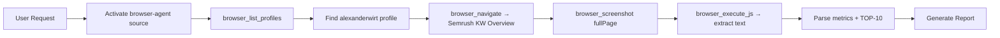

# Semrush Report Skill

Автоматизированный анализ SERP и конкурентов через Semrush. Использует **Browser Agent** с профилем **alexanderwirt** — уже залогиненная сессия Chrome, без повторного логина.

## 🎯 Возможности

- 🔍 **Keyword Overview** — поисковый объем, сложность, CPC, интент
- 📊 **SERP Analysis** — TOP-10 результатов с метриками (AS, backlinks, traffic)
- 🏆 **Competitor Analysis** — детальный анализ конкурентов в выдаче
- 📈 **Keyword Variations** — связанные запросы и кластеры
- 🌍 **Global Search Volume** — распределение по странам
- 🎯 **SEO Strategy** — рекомендации для ранжирования
- 📸 **Screenshots** — визуальные отчеты из Semrush

---

## 🌐 Browser Agent (основной метод)

**ВСЕГДА использовать Browser Agent source с профилем `alexanderwirt`.**

Профиль alexanderwirt уже залогинен в Semrush через Chrome — никакого повторного логина не требуется.

### Архитектура



### Workflow (шаг за шагом)

**1. Активация Browser Agent**

Источник `browser-agent` должен быть активен. Bridge Server должен работать:
```
D:\Claude\sources\browser-agent\bridge\ → npm start
```

**2. Найти профиль alexanderwirt**
```typescript
browser_list_profiles()
// → ищем профиль с именем/email alexanderwirt
```

**3. Навигация к Keyword Overview**
```typescript
browser_navigate({
  url: "https://www.semrush.com/analytics/keywordoverview/?q=<KEYWORD>&db=de",
  profileId: <alexanderwirt_profile_id>
})
// Ждать загрузку ~5-10 сек
```

**4. Скриншот результатов**
```typescript
browser_screenshot({ fullPage: true })
// → base64 PNG для отчёта
```

**5. Извлечение текста и данных**
```typescript
browser_execute_js({
  code: "return document.body.innerText",
  profileId: <alexanderwirt_profile_id>
})
// → парсим Volume, KD, CPC, Intent, TOP-10
```

**6. Генерация отчёта** — см. раздел "Формат вывода"

---

## 📋 Использование

```
/semrush-report Leuchtreklame berlin
/semrush-report elektrofirma Berlin
/semrush-report keyword="iPhone 15" database=de
```

```
/sr Leuchtreklame berlin   ← shortcut
```

---

## 📊 Формат вывода

### 1. Key Metrics
| Метрика | Значение |
|---------|---------|
| Search Volume | X/мес |
| Keyword Difficulty | X% |
| CPC | €X.XX |
| Intent | Commercial / Informational / ... |
| Competition | 0.XX |

### 2. TOP-10 SERP
| # | Domain | AS | Backlinks | Traffic |
|---|--------|-----|-----------|---------|
| 1 | domain.de | X | X | X |
| ... | | | | |

### 3. SEO Strategy
- Сложность ранжирования (Low / Medium / High)
- Рекомендации по контенту
- Backlink стратегия
- Коммерческий потенциал (ROI)

### 4. Keyword Variations
- Связанные запросы с объёмами
- Кластеры по интенту

---

## 🔧 Предварительные условия

1. **Bridge Server запущен:**
   ```bash
   cd D:\Claude\sources\browser-agent\bridge
   npm start
   ```

2. **Chrome расширение установлено** в профиле alexanderwirt
   - `chrome://extensions/` → расширение показывает зелёный ✓

3. **Alexanderwirt залогинен в Semrush** в Chrome
   - Email: `alexanderwirt@gmail.com` (Semrush Pro)

---

## 🐛 Troubleshooting

| Проблема | Решение |
|---------|---------|
| "No active profile found" | Запустить Bridge Server (`npm start` в `bridge/`) |
| Профиль alexanderwirt не найден | Проверить `browser_list_profiles()`, убедиться что расширение установлено в этом профиле |
| Метрики не извлеклись | Проверить скриншот — Semrush мог обновить UI, скорректировать regex паттерны |
| Semrush просит логин | Зайти вручную в Chrome через профиль alexanderwirt, залогиниться |

---

## 🔄 Legacy Fallback (Playwright Scraper)

Если Browser Agent недоступен — использовать скрипт:
```
skills/semrush-report/scripts/semrush-scraper.js
```
Требует: `config/semrush-credentials.json`, Node.js + Playwright.
**Использовать только как последний резерв.**

---

## 🔄 Workflow Integration

```mermaid
graph LR
    A[/sr keyword] --> B[Browser Agent]
    B --> C[Semrush alexanderwirt]
    C --> D[Metrics + TOP-10]
    D --> E[SEO Report]
    E --> F[content-creator]
    E --> G[link-builder]
```

**Pipeline:**
1. **Research**: `/sr elektrofirma Berlin`
2. **Content**: Создать landing page на основе TOP-10 insights
3. **Links**: Найти backlink возможности из конкурентов
4. **Monitor**: Отслеживать позиции еженедельно

---

## 📈 Metrics & KPIs

- **Search Volume** — месячный объем поиска
- **Keyword Difficulty** — 1-100 (сложность ранжирования)
- **CPC** — цена клика в рекламе
- **Competition Density** — 0-1 (конкуренция в ads)
- **Search Intent** — Commercial / Informational / Transactional / Navigational
- **SEO Opportunity Score** = (High CPC + Low KD) / Competition
- **Organic Value** = Volume × CPC × CTR

---

## 🚀 Future Enhancements

- [ ] Domain Overview scraping
- [ ] Backlink Gap analysis
- [ ] Position Tracking automation
- [ ] Multi-keyword batch analysis
- [ ] Export to Google Sheets

---

**Version:** 2.0 — Browser Agent
**Updated:** 2026-02-17
**Author:** WS Workspace
